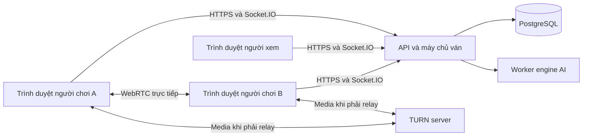

> **ĐÃ CÓ ĐẶC TẢ THAY THẾ:** Đọc [docs/README.md](docs/README.md) và [bộ issue](docs/issues/README.md) để triển khai. Tài liệu này giữ lại làm bản phân tích ban đầu; các giả định AI engine, 2 người xem, media chỉ đối thủ và auth tự quản đã được thay thế sau phỏng vấn. Không dùng các giả định cũ làm yêu cầu thực thi.

# PHÂN TÍCH VÀ KẾ HOẠCH DỰ ÁN CỜ TƯỚNG ONLINE

> Tài liệu đề xuất để trao đổi với giảng viên và làm cơ sở triển khai.
> Ngày lập: 12/09/2026. Trạng thái: bản phân tích ban đầu, chưa phải đặc tả đã được duyệt.
> Các lựa chọn công nghệ, giới hạn và mốc thời gian dưới đây là đề xuất; các yêu cầu gốc được giữ riêng để tránh nhầm với phần mở rộng.

## 1. Mục tiêu và phạm vi

Xây dựng một ứng dụng cờ tướng trên trình duyệt: người dùng đăng ký/đăng nhập, tạo phòng và mời đối thủ, chơi trực tuyến, cho phép người khác vào xem theo quyền của phòng, trò chuyện bằng văn bản và gọi camera/mic giữa hai người chơi. Ngoài ra, người dùng có thể chơi với máy theo nhiều mức độ.

**Sản phẩm hoàn chỉnh phải có đủ cả chơi online, người xem, chat, camera/mic và chơi với máy.** Bản MVP ở tài liệu này chỉ là mốc trung gian để giảm rủi ro, không phải lý do bỏ các yêu cầu còn lại.

### 1.1. Ánh xạ yêu cầu gốc

| Mã | Yêu cầu | Kết quả cần có |
|---|---|---|
| FR-01 | Đăng ký/đăng nhập | Tạo tài khoản, xác thực, đăng xuất, hiển thị lỗi rõ ràng |
| FR-02 | Tạo phòng | Tạo phòng có người chủ trì, chế độ truy cập và hai ghế chơi |
| FR-03 | Mời bạn | Mời trong ứng dụng; chia sẻ link; nhập mã phòng |
| FR-04 | Khởi tạo bàn cờ | Bàn 9 cột × 10 hàng giao điểm, 32 quân, đúng vị trí và lượt |
| FR-05 | Hai người chơi qua mạng | Máy chủ xác nhận luật, lượt và đồng bộ nước đi |
| FR-06 | Quản lý người xem | Công khai, khóa hoàn toàn, hoặc vào xem bằng mã; giới hạn số người xem |
| FR-07 | Chat và camera/mic | Chat riêng hai người chơi; chat riêng người xem; camera và âm thanh giữa hai người chơi |
| FR-08 | Chơi với máy | Chọn cấp độ; máy trả nước đi hợp lệ; kết thúc ván đúng quy tắc |

### 1.2. Các giả định dùng để lập kế hoạch

1. Là **website responsive**, ưu tiên máy tính, hỗ trợ thao tác cơ bản trên điện thoại; chưa làm ứng dụng mobile native.
2. Người chơi và người xem đều đăng nhập. Khách chưa đăng nhập chỉ xem trang giới thiệu và danh sách phòng công khai.
3. Mỗi phòng tối đa **2 người chơi + 2 người xem** ở cả ba chế độ. Câu “tối đa 2 người xem” trong đề có thể chỉ áp dụng cho phòng khóa bằng mã; đây là điểm phải xác nhận.
4. Camera/mic chỉ truyền giữa hai người chơi. Người xem không nghe, không thấy và không tham gia cuộc gọi.
5. Chat người chơi và chat người xem được tách quyền đọc lẫn quyền gửi. Người chơi không đọc kênh người xem trong lúc thi đấu để hạn chế hỗ trợ nước đi từ bên ngoài.
6. “Mời bạn ngay trong game” nghĩa là tìm tài khoản theo tên và gửi lời mời trong ứng dụng. Chưa bắt buộc hệ thống kết bạn hai chiều.
7. Chọn ba cấp độ máy: dễ, trung bình, khó. Không cam kết mức Elo khi chưa đo.
8. Một tài khoản chỉ tham gia một ván đang diễn ra với vai trò người chơi. Mở nhiều tab không tạo thêm ghế.
9. Không bắt buộc bật camera hay mic để chơi. Người dùng có thể từ chối quyền thiết bị.
10. Ban đầu mỗi phòng phục vụ một ván; tái đấu và đổi bên là phần mở rộng.

### 1.3. Cần chốt với giảng viên trước khi bắt đầu lập trình

| Câu hỏi | Đề xuất mặc định | Tác động nếu khác |
|---|---|---|
| Web hay desktop/mobile? | Web responsive | Thay đổi giao diện, đóng gói và hỗ trợ camera |
| Giới hạn 2 người xem áp dụng cho phòng nào? | Mọi phòng | Nếu công khai không giới hạn phải sửa phân trang, tải realtime và thử tải |
| Người xem có được xem/nghe camera của người chơi? | Không | Nếu có sẽ tăng phạm vi quyền riêng tư, kiến trúc media và băng thông |
| Có bắt buộc danh sách bạn bè? | Không; tìm tên và mời | Nếu có cần yêu cầu kết bạn/chấp nhận/chặn |
| AI phải tự viết hay được dùng engine? | Được tích hợp engine | Nếu phải tự viết cần thêm thời gian thuật toán và đo chất lượng |
| Có áp dụng đầy đủ luật thi đấu WXF? | Luật cơ bản + quy tắc lặp được công bố rõ | Luật đuổi quân/lặp phức tạp cần bộ kiểm thử và thời gian riêng |
| Có đồng hồ thi đấu? | Không bắt buộc trong phạm vi đầu | Nếu có phải xử lý thời gian tại server, mất mạng và hết giờ |
| Thời hạn, số thành viên, công nghệ bắt buộc? | Ước lượng theo nhóm 2–3 người | Quyết định lịch và lựa chọn stack |
| Phải chạy trên Internet thật hay chỉ LAN? | Internet thật, hai mạng khác nhau | Cần HTTPS, hosting realtime và TURN |

Không cần chờ mọi lựa chọn mở rộng mới nghiên cứu luật hoặc dựng prototype. Tuy nhiên phải chốt tiêu chí AI, bộ luật và phạm vi người xem trước khi cam kết tiến độ cuối cùng.

### 1.4. Ngoài phạm vi mặc định

Xếp hạng Elo, giải đấu, thanh toán, phân tích ván chuyên sâu, livestream công khai camera, ghi hình cuộc gọi, mạng xã hội, chống gian lận bằng nhận diện AI, ứng dụng mobile native. Quên mật khẩu/xác minh email nên bổ sung nếu mở dùng thật; chưa mặc định là điều kiện demo của đề.

## 2. Vai trò và quyền

| Hành động | Chưa đăng nhập | Chủ phòng | Đối thủ | Người xem |
|---|---|---|---|---|
| Xem danh sách phòng công khai | Có | Có | Có | Có |
| Tạo phòng | Không | Có | Có, khi không đang chơi | Có, khi rời phòng |
| Sửa chế độ xem | Không | Có | Không | Không |
| Mời đối thủ vào ghế trống | Không | Có | Không | Không |
| Đi quân | Không | Khi đúng lượt của mình | Khi đúng lượt của mình | Không |
| Đọc/gửi chat người chơi | Không | Có | Có | Không |
| Đọc/gửi chat người xem | Không | Không | Không | Có |
| Gọi camera/mic trong ván | Không | Có | Có | Không |
| Nhận trạng thái bàn cờ | Không | Có | Có | Có, sau khi được cấp quyền |

Vai trò chủ phòng là quyền quản lý phòng, không phải quyền quyết định kết quả. Chủ phòng không được tự sửa bàn cờ, ép đối thủ thua hoặc xóa ván đang diễn ra.

### 2.1. Tách quyền vào chơi khỏi quyền vào xem

- Ghế đối thủ cần lời mời chơi hợp lệ hoặc mã mời chơi. Biết mã xem không có nghĩa được ngồi ghế chơi.
- Mỗi lời mời có `role`, thời hạn, người nhận nếu mời trực tiếp và trạng thái sử dụng.
- Mã phòng dùng để định vị phòng. Mã truy cập dùng để cấp quyền; không coi ID dễ đoán là bí mật bảo vệ phòng.
- Có thể hiển thị một ô “Nhập mã tham gia”; backend xác định mã đó cấp quyền chơi hay xem.
- Link mời chỉ mang quyền tối thiểu tương ứng, không mang token đăng nhập.

### 2.2. Ba chế độ xem

| Chế độ | Hiện trong danh sách | Điều kiện vào xem | Số ghế xem đề xuất |
|---|---|---|---|
| `PUBLIC` | Có | Đăng nhập và còn chỗ | 2 |
| `LOCKED` | Không | Từ chối mọi người xem | 0 |
| `CODE_ONLY` | Không | Đăng nhập, mã xem còn hiệu lực, còn chỗ | 2 |

Quy tắc thay đổi: khi chuyển sang `LOCKED`, thu hồi quyền và ngắt đăng ký nhận dữ liệu của toàn bộ người xem hiện tại. Khi chuyển từ `PUBLIC` sang `CODE_ONLY`, người xem hiện tại phải xác thực lại bằng mã. Đổi mã xem cũng thu hồi quyền xem đã cấp bằng mã cũ. Giao diện phải thông báo tác động trước khi chủ phòng thực hiện.

Giới hạn ghế phải kiểm tra nguyên tử tại server, kể cả khi ba người bấm vào cùng lúc. Tab mới của cùng tài khoản dùng chung một tư cách thành viên; người thứ ba khác tài khoản nhận `ROOM_FULL`.

## 3. Luồng sử dụng

### 3.1. Đăng ký và đăng nhập

1. Nhập tên đăng nhập, tên hiển thị, mật khẩu và xác nhận mật khẩu; email chỉ bắt buộc nếu chọn hỗ trợ khôi phục tài khoản.
2. Server kiểm tra định dạng, độ dài, tính duy nhất và băm mật khẩu.
3. Đăng nhập thành công tạo phiên; truy cập sảnh.
4. Khi đăng xuất hoặc phiên hết hạn, server thu hồi quyền HTTP và kết nối realtime tương ứng.

### 3.2. Tạo phòng và mời đối thủ

1. Chủ phòng chọn tên phòng và chế độ xem.
2. Server tạo phòng ở trạng thái `WAITING`; chủ phòng ngồi ghế đỏ theo mặc định.
3. Chủ phòng tìm tên người dùng để gửi lời mời, hoặc sao chép link/mã mời chơi.
4. Người nhận đăng nhập, mở lời mời và nhấn chấp nhận.
5. Server kiểm tra lời mời, ghế trống, trạng thái phòng và ràng buộc người chơi.
6. Hai bên nhấn “Sẵn sàng”; server tạo ván và khởi tạo bàn cờ.
7. Khi đã bắt đầu, ghế chơi bị cố định. Người ngoài không được thay thế người mất kết nối.

Nếu người được mời chưa online, lời mời được lưu và hiển thị trong hộp thông báo khi họ đăng nhập. Không cần gửi email để đáp ứng “mời trong game”.

### 3.3. Chơi trực tuyến

1. Người chơi chọn quân; client có thể gợi ý ô đi bằng module luật dùng chung.
2. Client gửi **ý định đi quân**, không gửi bàn cờ thay thế.
3. Server xác thực người gửi, vai trò, phiên bản ván, lượt và tính hợp lệ.
4. Server lưu nước đi cùng trạng thái mới trong một giao dịch.
5. Sau khi lưu thành công, server trả kết quả và phát trạng thái cho các thành viên được phép.
6. Client cập nhật bàn, lượt, lịch sử và thông báo chiếu/kết thúc.

### 3.4. Vào xem

Người xem chọn phòng công khai hoặc nhập mã xem, nhận snapshot hiện tại sau khi được cấp quyền, tiếp tục nhận nước đi mới và dùng kênh chat người xem. Vào xem giữa ván phải thấy đúng vị trí hiện tại, không khởi tạo lại bàn ban đầu.

### 3.5. Camera và mic

Một người gửi yêu cầu gọi, người còn lại chấp nhận; trình duyệt xin quyền camera/mic sau thao tác người dùng. Cho phép chỉ dùng mic, tắt mic, tắt camera, đổi thiết bị và kết thúc gọi. Cuộc gọi lỗi không được làm mất ván hoặc khóa thao tác đi quân.

### 3.6. Đấu máy

Chọn cấp độ và bên chơi → khởi tạo ván → người đi nước hợp lệ → worker AI tính nước → server kiểm tra nước AI → cập nhật bàn. Nếu người chọn đen thì máy đi đầu. Chế độ máy không cần camera, lời mời hoặc người xem để hoàn thành yêu cầu gốc.

## 4. Quy tắc cờ tướng và mô hình bàn cờ

### 4.1. Quy ước dữ liệu

- Bàn có 90 giao điểm: `x = 0..8`, `y = 0..9`.
- Trong dữ liệu chuẩn, đen ở phía trên (`y = 0`), đỏ ở phía dưới (`y = 9`), đỏ đi trước.
- Góc nhìn có thể lật theo bên chơi; tọa độ server giữ nguyên.
- Mỗi quân có `id`, `type`, `side`, `position`; ô trống là `null`.
- Loại quân: `GENERAL`, `ADVISOR`, `ELEPHANT`, `HORSE`, `ROOK`, `CANNON`, `PAWN`.
- Trạng thái cần có bàn cờ, bên đến lượt, trạng thái ván, lịch sử và phiên bản.

Vị trí khởi đầu: hàng 0 và 9 lần lượt là Xe–Mã–Tượng–Sĩ–Tướng–Sĩ–Tượng–Mã–Xe; pháo ở `(1,2),(7,2)` và `(1,7),(7,7)`; tốt ở các cột `0,2,4,6,8` trên hàng 3 và 6. Sông nằm giữa hàng 4 và 5.

### 4.2. Các luật cần kiểm thử

| Quân/tình huống | Điều kiện chính |
|---|---|
| Tướng | Đi một bước ngang/dọc trong cung; không để hai tướng đối mặt không có quân chắn |
| Sĩ | Đi chéo một bước trong cung |
| Tượng | Đi chéo hai bước, không qua sông, không bị chặn mắt tượng |
| Mã | Đi theo hình chữ L, không bị cản chân mã |
| Xe | Đi thẳng ngang/dọc, không xuyên quân |
| Pháo | Không ăn: đường trống; ăn: đúng một quân làm ngòi giữa hai đầu |
| Tốt | Chưa qua sông chỉ tiến; qua sông được tiến/ngang; không lùi |
| Mọi quân | Không ăn quân cùng bên, không đi ra ngoài bàn |
| An toàn tướng | Sau nước đi, tướng bên đi không được bị chiếu |
| Hết nước hợp lệ | Bên không còn nước hợp lệ thua, kể cả không đang bị chiếu |

Tham khảo luật cơ bản từ tài liệu của [GNU XBoard](https://www.gnu.org/software/xboard/whats_new/rules/Xiangqi.html). Nên kết thúc bằng kiểm tra trạng thái hợp lệ/chiếu hết, không xây dựng luồng chơi cho phép “ăn tướng” như một nước thông thường.

### 4.3. Luật lặp và kết thúc ván

Cờ tướng không được bê nguyên luật hòa do lặp ba lần của cờ vua. Chiếu dai và đuổi dai có cách phân xử riêng; cần lựa chọn chính xác một bộ luật. Nguồn đối chiếu: [World Xiangqi Rules 2018 của WXF](https://www.wxf-xiangqi.org/images/wxf-rules/2018_World_XiangQi_Rules_English2018.pdf).

Hai phương án:

- **Tuân thủ bộ luật thi đấu:** triển khai đầy đủ các tình huống của bộ luật đã chọn và bộ ví dụ đối chiếu. Phải dự trù thêm lịch.
- **Bản học tập có luật giản lược:** đủ luật di chuyển và an toàn tướng; hai bên được đồng ý hòa; một vị trí gồm bàn cờ và lượt xuất hiện lần thứ ba được xử hòa theo quy ước riêng của ứng dụng. Phải được giảng viên đồng ý và hiển thị rõ “luật giản lược”, không quảng bá là chuẩn WXF.

Đề xuất lập kế hoạch ban đầu theo phương án thứ hai; nếu chưa được đồng ý thì đây vẫn là quyết định mở, chưa phải tiêu chí nghiệm thu cuối cùng. Lưu `ruleSetVersion` trong mỗi ván để sau này không áp luật mới lên lịch sử cũ.

Các lý do kết thúc được lưu riêng: chiếu hết, hết nước hợp lệ, đầu hàng, đồng ý hòa, quy tắc lặp đã chọn, mất kết nối theo chính sách, hoặc gián đoạn hệ thống. Hết giờ chỉ bổ sung nếu triển khai đồng hồ.

### 4.4. Module luật độc lập

Giao diện đề xuất:

```text
createInitialState(ruleSetVersion) -> GameState
getLegalMoves(state, side) -> Move[]
validateMove(state, move, side) -> ValidationResult
applyMove(state, move) -> GameState
evaluateGameStatus(state, history) -> GameResult | null
```

Module không phụ thuộc giao diện, database hoặc Socket.IO. Client dùng để gợi ý; server vẫn kiểm tra lại. Engine AI không thay thế quyền phân xử của module luật.

## 5. Công nghệ và kiến trúc đề xuất

### 5.1. Stack mặc định

| Thành phần | Đề xuất | Lý do / lưu ý |
|---|---|---|
| Frontend | React + TypeScript + Vite | Phù hợp UI tương tác; không cần SSR cho bàn cờ |
| Bàn cờ | SVG + CSS | Dễ co giãn, đánh dấu nước và xử lý tọa độ |
| Backend | Node.js + TypeScript + Fastify | API và tiến trình realtime trong cùng một ứng dụng |
| Realtime | Socket.IO | Event, room và acknowledgement tiện cho điều phối ván |
| Database | PostgreSQL | Giao dịch, ràng buộc và lưu lịch sử |
| Truy cập DB | Prisma hoặc SQL có kiểu; chọn một | Prisma phù hợp nhóm muốn migration/schema rõ ràng |
| Xác thực | Session cookie + session lưu server | Đơn giản hóa thu hồi phiên cho web cùng site |
| Gọi hình/tiếng | WebRTC P2P + STUN/TURN | Cuộc gọi một-một giữa hai người chơi |
| AI | Pikafish chạy trong worker riêng | Tránh tự xây AI mạnh nếu đề cho phép engine |
| Test | Vitest, Playwright, kiểm thử tích hợp PostgreSQL | Bao phủ luật, nhiều người dùng và giao diện |
| Môi trường | Docker Compose | Dựng DB, server, AI và TURN có cấu hình rõ ràng |
| Quản lý việc | GitHub Issues/Projects hoặc Trello sẵn có | Theo dõi việc, tiêu chí và lỗi; không cần dùng cả hai |

Đây là lựa chọn thiết kế, không phải yêu cầu bắt buộc. Chốt phiên bản cụ thể khi khởi tạo, lưu lockfile và không dùng tag `latest` cho bản demo cuối. Nếu nhóm đã giỏi Java/Spring Boot hoặc C#/ASP.NET thì giữ backend quen thuộc; vẫn giữ các ranh giới module dưới đây. Không nên vừa học nhiều framework mới vừa xử lý realtime và media.

### 5.2. Sơ đồ tổng thể



API vận chuyển tín hiệu cuộc gọi; âm thanh/hình ảnh đi qua WebRTC, không gửi video liên tục qua Socket.IO. Người xem không có kết nối media.

### 5.3. Các module

- `auth`: tài khoản, phiên và đăng xuất.
- `rooms`: ghế chơi/xem, chế độ truy cập, mã tham gia.
- `invitations`: lời mời trực tiếp và link/mã có thời hạn.
- `game-rules`: logic cờ thuần.
- `matches`: trạng thái, nước đi, kết quả, khôi phục kết nối.
- `chat`: hai kênh và lịch sử có phân quyền.
- `calls`: trạng thái cuộc gọi, signaling, cấp thông tin TURN.
- `ai`: hàng đợi giới hạn, quản lý engine và timeout.

Khởi đầu bằng **một backend chia module + một worker AI**, không cần microservices, Kubernetes hay message broker riêng. Redis chỉ bổ sung khi có nhu cầu nhiều instance hoặc điều phối nhiều worker; thêm adapter Socket.IO không tự giải quyết xung đột nước đi.

## 6. Đồng bộ thời gian thực và mất kết nối

### 6.1. Máy chủ là nguồn trạng thái chính thức

Payload đi quân đề xuất:

```json
{
  "matchId": "...",
  "clientMoveId": "uuid-duy-nhat",
  "expectedVersion": 12,
  "from": { "x": 0, "y": 6 },
  "to": { "x": 0, "y": 5 }
}
```

Không nhận `userId` hoặc `side` từ client làm bằng chứng quyền; lấy danh tính từ phiên đã xác thực và ghế trong ván.

Xử lý tuần tự:

1. Kiểm tra schema, phiên, thành viên và trạng thái ván.
2. Bắt đầu giao dịch, khóa hàng ván hoặc dùng compare-and-swap phiên bản.
3. Tìm `clientMoveId` đã xử lý của người gửi; nếu có, trả đúng kết quả cũ.
4. Kiểm tra `expectedVersion`, bên đến lượt và nước hợp lệ trên trạng thái đã khóa.
5. Ghi move, snapshot, lượt tiếp theo, phiên bản và kết quả trong cùng giao dịch.
6. Commit rồi mới acknowledge/broadcast. Không báo nhận nước thành công trước khi lưu.

Ràng buộc duy nhất trên `(matchId, version)` và `(matchId, actorId, clientMoveId)`. Không chỉ khóa trong RAM nếu sau này chạy nhiều instance.

### 6.2. Khôi phục trạng thái

- Client lưu phiên bản cuối; mỗi bản cập nhật chứa `version`.
- Nhận phiên bản đã áp dụng thì bỏ qua; phát hiện khoảng trống thì yêu cầu đồng bộ.
- Khi connect/reconnect, server kiểm tra lại quyền rồi gửi snapshot chính thức.
- Ack bị mất: gửi lại **cùng** `clientMoveId`, không tạo ID khác.
- Server chết sau commit nhưng trước broadcast: khi reconnect hoặc đối soát phiên bản, client nhận snapshot đã lưu.
- Đề xuất đối soát `match:sync` mỗi 15 giây khi đang có ván để phát hiện cập nhật cuối bị mất dù socket vẫn sống; tối ưu thành cơ chế khác sau khi đo tải.
- Client hiển thị trạng thái “Đang gửi/Đang kết nối lại”, không cho gửi chuỗi nước mới dựa trên trạng thái chưa xác nhận.

Socket.IO giữ thứ tự event nhưng mặc định giao tối đa một lần; mất kết nối có thể làm mất event. Vì vậy cần chính sách lưu trữ và đồng bộ của ứng dụng, không coi một lần `emit` là bằng chứng nước đi đã được lưu. Xem [delivery guarantees](https://socket.io/docs/v4/delivery-guarantees/). Cơ chế [connection state recovery](https://socket.io/docs/v4/connection-state-recovery/) hỗ trợ phục hồi nhưng không luôn thành công; vẫn phải có đường tải snapshot và kiểm tra lại quyền.

### 6.3. Chính sách mất mạng đề xuất

- Mất socket không đồng nghĩa rời ván chủ động.
- Giữ ghế người chơi trong 60 giây; người chơi còn lại vẫn được thực hiện lượt hợp lệ của mình, rồi chờ.
- Sau 60 giây, nếu đối thủ vẫn online thì người mất mạng thua theo quy ước của ứng dụng; thông báo quy tắc trước khi vào ván.
- Nếu cả hai cùng offline, không tùy tiện chọn một bên thắng; đánh dấu ván gián đoạn khi hết hạn.
- Khi backend khởi động lại, tạo khoảng khôi phục mới trước khi phân xử mất mạng; không tính lỗi server thành lỗi một người chơi.
- Người xem mất mạng được giữ ghế 15 giây; hết hạn giải phóng ghế.
- Deadline cần lưu bền vững và được kiểm tra lại sau restart; không chỉ dựa vào `setTimeout` trong bộ nhớ.
- “Đầu hàng” kết thúc ván ngay sau xác nhận. “Đóng tab” áp dụng chính sách mất mạng.

Các con số trên là cấu hình sản phẩm đề xuất, không phải luật cờ tướng tiêu chuẩn.

## 7. Chat và camera/mic

### 7.1. Chat

Có hai kênh: `PLAYERS` và `SPECTATORS`. Backend suy ra kênh được phép từ membership, kiểm tra quyền khi gửi, khi subscribe và khi tải lịch sử. Chỉ ẩn tab chat ở giao diện là không đủ.

Đề xuất: tin nhắn văn bản tối đa 1.000 ký tự; giới hạn ban đầu 5 tin/10 giây/người; server cấp timestamp và ID. Hiển thị như văn bản thuần, không render HTML người dùng. Lưu `clientMessageId` để retry không tạo tin trùng, phân trang lịch sử 50 tin/lần.

Lịch sử người chơi chỉ phục vụ hai tài khoản thuộc ván. Lịch sử người xem trong phiên bản đầu chỉ đọc được khi người dùng vẫn có quyền xem phòng; người bị thu hồi quyền không tải được thêm. Nội dung đã được họ đọc trước đó không thể thu hồi khỏi trí nhớ hoặc ảnh chụp.

### 7.2. Luồng WebRTC

1. Server xác nhận hai bên là người chơi của cùng ván đang hoạt động.
2. Bên gọi tạo `callId`, gửi lời mời; đối thủ nhận/chấp nhận hoặc từ chối.
3. Sau thao tác chấp thuận, gọi API thiết bị của trình duyệt.
4. Trao đổi SDP offer/answer và ICE candidate qua signaling có xác thực.
5. WebRTC tìm đường trực tiếp; dùng TURN relay khi cần.
6. Khi kết thúc/rời ván/đăng xuất, đóng peer connection và dừng các media track.

Chỉ định người khởi tạo offer, hoặc xử lý va chạm đàm phán theo mẫu phù hợp để tránh hai bên cùng gọi bị treo. Mọi message phải kiểm tra `callId`, thành viên đích và trạng thái; không cho client chuyển signaling đến một tài khoản bất kỳ.

Cơ sở kỹ thuật: [MDN về getUserMedia](https://developer.mozilla.org/en-US/docs/Web/API/MediaDevices/getUserMedia), [WebRTC connectivity](https://developer.mozilla.org/en-US/docs/Web/API/WebRTC_API/Connectivity) và [IETF RFC 8656 về TURN](https://datatracker.ietf.org/doc/html/rfc8656).

### 7.3. Hạ tầng và trải nghiệm

- Production phải có HTTPS để dùng thiết bị media trong ngữ cảnh an toàn.
- Cần STUN và TURN; chỉ thử hai tab trên một máy không chứng minh gọi được qua Internet.
- TURN có credential ngắn hạn do server cấp; không nhúng mật khẩu quản trị cố định trong frontend.
- Kiểm thử có chủ đích với `iceTransportPolicy: "relay"` để chứng minh TURN thực sự hoạt động.
- Đặt chất lượng ban đầu khoảng 360p/480p và đo thực tế trước khi tăng.
- Giao diện phải hiện trạng thái mic/camera, đối thủ đang gọi, bị từ chối quyền và kết nối lỗi.
- Không tự động ghi âm/ghi hình. Không lưu SDP hoặc nội dung media vào log thường lệ.
- Sau refresh cần đồng bộ ván trước, rồi cho người dùng nối lại cuộc gọi với signaling mới.

## 8. AI theo cấp độ

### 8.1. Lựa chọn

| Hướng | Ưu điểm | Nhược điểm | Khi chọn |
|---|---|---|---|
| Tự viết minimax + alpha-beta | Giải thích được thuật toán và hàm lượng giá | Tốn công, khó đạt sức mạnh cao | Môn học bắt buộc tự xây AI |
| Tích hợp Pikafish | Engine chuyên cờ tướng; tập trung vào sản phẩm | Quản lý tiến trình, tài nguyên và giấy phép | Đề cho phép dùng engine |

Khuyến nghị tích hợp engine nếu mục tiêu môn học là hệ thống phần mềm. Nếu mục tiêu là trí tuệ nhân tạo, đổi kế hoạch sang tự viết trước khi triển khai.

### 8.2. Ba cấp độ đề xuất

- **Dễ:** giới hạn ngân sách tìm kiếm; có thể chọn ngẫu nhiên có kiểm soát trong các ứng viên hợp lệ đủ tốt nếu engine hỗ trợ lấy nhiều ứng viên.
- **Trung bình:** ngân sách cao hơn, giảm độ ngẫu nhiên.
- **Khó:** ngân sách cao nhất trong khả năng máy chủ, ưu tiên nước tốt nhất engine tìm được.

Mốc thử ban đầu có thể là 100/500/1.500 ms mỗi lượt, nhưng **thời gian suy nghĩ không bảo đảm khác biệt sức mạnh rõ ràng**. Chốt cấu hình sau khi chạy tập thế cờ và đấu đối kháng. Không giả định engine có sẵn tham số `Skill Level` hoặc Elo; kiểm tra danh sách option của đúng binary bằng UCI.

### 8.3. Tích hợp an toàn và nhất quán

- Adapter chuyển tọa độ/bàn cờ sang định dạng vị trí engine hỗ trợ và chuyển nước trả về ngược lại.
- Có test ánh xạ hướng bàn, đỏ/đen và ván người chọn đen.
- Mỗi job có `matchId`, `version`, giới hạn thời gian, cấu hình engine và quyền sở hữu phiên xử lý.
- Không dùng chung một tiến trình engine cho các ván đồng thời nếu không có cơ chế tuần tự/reset chính xác.
- Giới hạn ban đầu hai job AI đồng thời; hàng đợi có trần, từ chối rõ ràng khi quá tải.
- Kết quả cũ sau khi đầu hàng/kết thúc hoặc phiên bản đã đổi phải bị loại.
- Server kiểm tra nước máy bằng module luật trước khi chấp nhận.
- Timeout/crash: thử lại tối đa một lần; vẫn lỗi thì hiển thị ván bị gián đoạn, không tự coi người chơi thua.
- Engine chạy ngoài luồng xử lý HTTP/socket, có giới hạn CPU/RAM và cơ chế thu dọn tiến trình.

Pikafish dùng giao thức UCI. Adapter khởi tạo bằng `uci`/`uciok`, kiểm tra `isready`/`readyok`, thiết lập ván và vị trí, gửi lệnh tìm kiếm rồi đọc `bestmove`; kiểm tra option theo binary được khóa phiên bản. Tham khảo [Pikafish upstream](https://github.com/official-pikafish/Pikafish) và [UCI & Commands](https://github.com/official-pikafish/Pikafish/wiki/UCI-%26-Commands).

**Giấy phép:** mã engine công bố theo GPLv3; bộ trọng số NNUE có điều khoản riêng, trong đó upstream hạn chế dùng thương mại nếu chưa được phép. Lưu license/source tương ứng khi đóng gói engine và kiểm tra đúng bộ trọng số trước phát hành; không suy ra quyền dùng trọng số từ giấy phép mã nguồn. Nguồn: [engine terms](https://github.com/official-pikafish/Pikafish#terms-of-use), [Networks README](https://github.com/official-pikafish/Networks/blob/master/README.md).

### 8.4. Nếu phải tự viết AI

Triển khai theo thứ tự: sinh nước hợp lệ → hàm lượng giá vật chất/vị trí/an toàn tướng → minimax → alpha-beta → sắp xếp nước → iterative deepening có deadline. Chỉ bổ sung bảng chuyển vị hoặc tìm kiếm sâu hơn sau khi phiên bản đơn giản chạy đúng. Chất lượng AI được đánh giá trên thế cờ chiến thuật và các ván có cùng điều kiện; không chấm chỉ bằng độ sâu tìm kiếm.

## 9. Thiết kế dữ liệu

| Bảng | Trường chính | Ghi chú |
|---|---|---|
| `users` | id, username, displayName, passwordHash, createdAt | Unique username chuẩn hóa |
| `sessions` | id/tokenHash, userId, expiresAt, revokedAt | Thu hồi cả HTTP và realtime |
| `rooms` | id, ownerId, name, visibility, status, spectatorLimit | Không dùng mã dễ đoán làm xác thực |
| `room_members` | roomId, userId, role, seat, admissionVersion, disconnectedAt, expiresAt | Unique thành viên và ghế chơi |
| `invitations` | id, roomId, senderId, recipientId?, role, tokenHash, expiresAt, status | Mời trực tiếp hoặc chia sẻ |
| `room_access_codes` | id, roomId, role, codeHash, accessVersion, expiresAt, revokedAt | Mã xem có thể dùng nhiều lần trong giới hạn ghế |
| `matches` | id, roomId?, mode, redUserId?, blackUserId?, aiSide?, aiLevel?, state, turn, version, ruleSetVersion, status, result, endReason | Lưu snapshot hiện tại; chế độ AI có một bên không phải user |
| `moves` | id, matchId, actorId, clientMoveId, version, from, to, piece, capturedPiece?, createdAt | Unique phiên bản và khóa chống trùng |
| `chat_messages` | id, roomId, matchId, senderId, channel, clientMessageId, content, createdAt | Quyền truy cập cả lịch sử |

`actorId` của move cần biểu diễn được người dùng hoặc máy, không ép máy thành tài khoản đăng nhập thật. Bảng trạng thái hiện tại và lịch sử move phải được ghi trong cùng giao dịch.

Chỉ mục chính: username, phiên theo tokenHash, phòng theo visibility/status, lời mời theo recipient/status, nước theo match/version, chat theo room/channel/time. Không lưu video/audio. Lịch sử chat đề xuất giữ 30 ngày cho bản demo mở Internet và có tác vụ xóa; thời hạn thực tế cần thống nhất trước khi đưa vào sử dụng.

### 9.1. Vòng đời

```text
Phòng: WAITING -> PLAYING -> FINISHED -> CLOSED
                     |
                     +-> INTERRUPTED -> CLOSED
Ván:   ACTIVE -> FINISHED hoặc INTERRUPTED
Lời mời: PENDING -> ACCEPTED / DECLINED / EXPIRED / REVOKED
```

Chủ phòng rời khi đang chờ: đóng phòng, thu hồi lời mời. Khi đang chơi: áp dụng đầu hàng hoặc mất kết nối theo hành động, không xóa lịch sử ván. Presence online/offline là trạng thái riêng, không thay thế trạng thái kết thúc ván.

## 10. API và sự kiện dự kiến

### 10.1. HTTP

| Phương thức / đường dẫn | Công dụng |
|---|---|
| `POST /auth/register` | Đăng ký |
| `POST /auth/login` | Đăng nhập |
| `POST /auth/logout` | Thu hồi phiên |
| `GET /me` | Người dùng hiện tại |
| `GET /users?username=...` | Tìm tài khoản để mời; không lộ email |
| `GET /rooms` | Danh sách phòng công khai có phân trang |
| `POST /rooms` | Tạo phòng |
| `PATCH /rooms/:id` | Đổi chế độ xem, kiểm tra chủ phòng |
| `POST /rooms/:id/invitations` | Tạo lời mời chơi/link |
| `GET /invitations` | Danh sách lời mời nhận được |
| `POST /invitations/:id/accept` | Chấp nhận và chiếm ghế nguyên tử |
| `POST /invitations/:id/decline` | Từ chối |
| `POST /rooms/join` | Nhập mã/link và cấp membership theo role |
| `POST /rooms/:id/access-code/rotate` | Đổi mã xem và thu hồi quyền cũ |
| `POST /rooms/:id/leave` | Rời theo trạng thái phòng/ván |
| `GET /matches/:id` | Snapshot sau kiểm tra quyền |
| `GET /rooms/:id/messages?cursor=...` | Lịch sử kênh được phép |
| `POST /ai/matches` | Tạo ván máy theo cấp độ |
| `POST /calls/turn-credentials` | Cấp credential ngắn hạn cho người chơi hợp lệ |

### 10.2. Realtime

| Hướng | Event | Vai trò |
|---|---|---|
| Client → server | `room:subscribe` | Kiểm tra membership trước khi nhận dữ liệu |
| Client → server | `player:ready` | Sẵn sàng bắt đầu |
| Server → client | `room:updated`, `invitation:received` | Trạng thái phòng/lời mời |
| Client → server | `match:move`, `match:sync` | Ý định đi và đồng bộ |
| Server → client | `match:state`, `match:ended` | Trạng thái có phiên bản/kết quả |
| Client → server | `match:resign`, `draw:offer`, `draw:respond` | Kết thúc tự nguyện có kiểm tra trạng thái |
| Client → server | `chat:send` | Server xác định/kiểm tra kênh |
| Server → client | `chat:message` | Chỉ gửi đúng nhóm quyền |
| Hai chiều qua server | `call:invite`, `call:accept`, `call:reject`, `call:signal`, `call:end` | Điều khiển gọi và signaling |
| Server → client | `presence:changed`, `access:revoked` | Kết nối và quyền bị thu hồi |

Các command dùng acknowledgement có timeout và lỗi ổn định: `UNAUTHENTICATED`, `FORBIDDEN`, `ROOM_FULL`, `INVITE_EXPIRED`, `NOT_YOUR_TURN`, `INVALID_MOVE`, `VERSION_CONFLICT`, `MATCH_ENDED`, `RATE_LIMITED`. Không trả thành công chỉ vì server nhận được gói tin.

## 11. Giao diện cần xây

| Màn hình | Nội dung |
|---|---|
| Đăng ký/đăng nhập | Form, lỗi, trạng thái đang gửi, liên kết qua lại |
| Sảnh | Tạo phòng, nhập mã, danh sách phòng công khai, lời mời, đấu máy |
| Phòng chờ | Hai ghế, trạng thái sẵn sàng, mời, copy link/mã, chế độ xem |
| Ván online | Bàn cờ, lượt, lịch sử, đối thủ, kết quả, chat người chơi, camera/mic |
| Xem ván | Bàn chỉ đọc, danh sách người xem, chat người xem, rời phòng |
| Chọn AI | Cấp độ, bên chơi, bắt đầu |
| Ván AI | Bàn, trạng thái máy suy nghĩ, đầu hàng, kết quả |

Trên desktop: bàn ở giữa, thông tin/chat bên cạnh, video không che bàn. Trên mobile: ưu tiên bàn cờ, chat/lịch sử ở tab hoặc khung thu gọn. Hiển thị tên quân rõ, lượt không chỉ dựa vào màu; nút có nhãn và focus, hỗ trợ bàn phím cho các thao tác chính. Dùng lưới khoảng cách 4/8 px, tương phản đủ đọc và vùng bấm phù hợp cảm ứng.

Thiết kế đủ trạng thái: phòng đầy, sai/hết hạn mã, chưa có đối thủ, reconnect, nước đi bị từ chối, hết phiên, không có camera, từ chối quyền và AI timeout.

## 12. Bảo mật và riêng tư

- Băm mật khẩu bằng Argon2id theo cấu hình tham khảo của [OWASP Password Storage](https://cheatsheetseries.owasp.org/cheatsheets/Password_Storage_Cheat_Sheet.html); không lưu mật khẩu gốc.
- Cookie production dùng `HttpOnly`, `Secure`, `SameSite` phù hợp; có cơ chế chống CSRF cho request thay đổi trạng thái dùng cookie.
- Kiểm tra Origin ở handshake và quyền trên từng message; thu hồi phiên khi logout. Tham khảo [OWASP WebSocket Security](https://cheatsheetseries.owasp.org/cheatsheets/WebSocket_Security_Cheat_Sheet.html).
- Server kiểm tra vai trò cho mọi HTTP endpoint và event; không tin dữ liệu client.
- Giới hạn thử mật khẩu/mã phòng theo tài khoản và IP; mã ngắn cần rate limit, thời hạn và khả năng thu hồi.
- Token mời dùng bộ sinh ngẫu nhiên mật mã, lưu hash; không ghi token vào log. Link token có thể nằm trong fragment và được gửi bằng POST để hạn chế xuất hiện trong access log.
- Validate payload, giới hạn kích thước message và chat; không render HTML từ người dùng.
- AI gọi binary bằng tham số cấu trúc, không ghép lệnh shell từ input.
- Secret ở biến môi trường; `.env.example` chỉ chứa tên biến và giá trị mẫu.
- Không ghi hình/âm thanh mặc định. Log vận hành không chứa mật khẩu, session token, mã mời hoặc nội dung chat riêng.
- Không thể ngăn tuyệt đối người dùng gian lận bằng một thiết bị khác; phần này không nằm trong cam kết sản phẩm.

## 13. Chỉ tiêu chất lượng và kiểm thử

### 13.1. Mục tiêu thử tải ban đầu

Đây là **mục tiêu nghiệm thu đề xuất, chưa phải số đo**:

- 10 phòng online hoạt động đồng thời, tối đa 40 thành viên; đo thêm tối đa 2 job AI và trường hợp gọi qua TURN.
- Thời gian server xử lý command nước đi p95 dưới 100 ms khi không chạy AI trong tiến trình server.
- Thời gian nhận kết quả nước đi đầu-cuối p95 dưới 500 ms trong môi trường thử có RTT dưới 100 ms.
- Reconnect và đồng bộ bàn trong 5 giây sau khi mạng ổn định, với server hoạt động bình thường.
- Không ghi hai nước vào cùng một phiên bản; không vượt ghế người xem; không rò nội dung chat/call giữa vai trò.

Ghi cấu hình CPU/RAM, mạng, số mẫu và tình trạng AI/TURN cùng kết quả. Nếu không đạt, đo nút thắt trước khi đổi kiến trúc.

### 13.2. Ma trận kiểm thử

| Nhóm | Trường hợp bắt buộc |
|---|---|
| Auth | Trùng tài khoản, sai mật khẩu, hết phiên, logout khi còn socket |
| Luật | Từng quân, cản mã/tượng, ngòi pháo, qua sông, cung, tướng đối mặt, tự chiếu, chiếu hết, hết nước |
| Bộ luật lặp | Ví dụ theo quy tắc đã duyệt; không nhầm với luật cờ vua |
| Ghế/phòng | Hai người cùng nhận ghế cuối; ba người giành hai ghế xem; nhiều tab một tài khoản |
| Mời | Trong ứng dụng online/offline, link, mã, sai role, hết hạn, thu hồi, nhận hai lần |
| Realtime | Sai lượt, giả danh, nước trùng, phiên bản cũ, mất ack, broadcast bị mất |
| Recovery | Refresh, mạng chập chờn, reconnect, server restart sau commit, cả hai offline |
| Phân quyền | Người xem gọi API đi quân/chat người chơi/signaling; thử tải lịch sử trực tiếp |
| Chuyển chế độ | PUBLIC → LOCKED/CODE_ONLY; đổi mã; người xem cũ không nhận dữ liệu mới |
| Media | Hai mạng khác nhau, chỉ mic, từ chối quyền, cùng gọi, TURN bắt buộc, ngắt media không mất ván |
| AI | Ba cấp, chọn đen, nước sai/cũ, crash, timeout, hàng đợi đầy, CPU không làm nghẽn online |
| UI | Desktop/mobile, bàn lật, loading/error, phím/tab và nút camera/mic |

### 13.3. Cách kiểm thử

1. Unit test module luật bằng thế cờ cụ thể, kiểm tra trạng thái đầu ra.
2. Integration test API/socket với PostgreSQL thật trong môi trường test riêng; mô phỏng tranh ghế và trùng command.
3. Playwright dùng ít nhất bốn browser context độc lập: hai người chơi, hai người xem; context thứ năm thử vượt giới hạn.
4. Media giả phù hợp CI; kiểm thử camera thật và hai mạng khác nhau vẫn phải làm trước nghiệm thu.
5. Thử tải bằng client hỗ trợ đúng giao thức Socket.IO; không mặc định công cụ WebSocket thuần dùng được nguyên trạng.
6. Báo cáo lưu lệnh chạy, commit, môi trường và kết quả; không ghi “đã test” nếu chỉ mở trang thành công.

## 14. Lộ trình triển khai

Ước lượng **8–10 tuần cho nhóm 2–3 người có nền tảng web**, cần hiệu chỉnh theo số giờ thực tế. Nếu một người mới học làm toàn bộ, dự trù khoảng 12–16 tuần hoặc hơn. Đây không phải cam kết tiến độ khi chưa biết thời hạn, trình độ và yêu cầu AI.

| Mốc | Công việc | Đầu ra và điều kiện qua mốc |
|---|---|---|
| Tuần 1 | Chốt phạm vi/bộ luật, wireframe, spike WebRTC hai mạng và gọi engine | Quyết định được AI, quyền xem và khả năng media; ghi vấn đề còn mở |
| Tuần 2 | Repo, CI, DB, auth; module luật và bàn cờ local | Đăng nhập chạy; kiểm thử vị trí ban đầu và luật cốt lõi qua |
| Tuần 3 | Phòng, ghế, ready, ván online | Hai trình duyệt đi đúng lượt; server từ chối nước sai |
| Tuần 4 | Lưu move/snapshot, chống trùng, reconnect, kết quả | Refresh/mất ack không lệch bàn; lịch sử bền vững |
| Tuần 5 | Mời trong app/link/mã, ba chế độ xem, hai chat | Đủ FR-03/06 và chat; test phân quyền và tranh ghế qua |
| Tuần 6 | Tích hợp camera/mic hoàn chỉnh, TURN | Hai mạng khác nhau gọi được; người xem không tham gia media |
| Tuần 7 | AI ba mức, worker, giới hạn tài nguyên | Máy đi hợp lệ; cấp độ được thử; không nghẽn ván online |
| Tuần 8 | Triển khai Internet, E2E, thử tải, báo cáo/demo | Đủ FR-01…08, lưu bằng chứng nghiệm thu |
| Tuần 9–10 | Dự phòng lỗi mạng, luật, thiết bị và hoàn thiện | Đóng lỗi quan trọng, diễn tập và bàn giao |

**MVP kỹ thuật cuối tuần 4:** auth + phòng + bàn đúng luật cơ bản + hai người online + khôi phục. Đây chưa phải bản bàn giao đầy đủ.

Đường phụ thuộc chính: chốt bộ luật → module luật → giao dịch nước đi → đồng bộ → phân quyền người xem/chat. WebRTC và engine nên thử tính khả thi ngay tuần đầu để phát hiện trở ngại sớm, rồi tích hợp sau khi luồng ván ổn định.

### 14.1. Chia việc nếu có ba người

- Thành viên A: giao diện, bàn cờ, thao tác và responsive.
- Thành viên B: auth, database, phòng, realtime, phân quyền và deploy.
- Thành viên C: module luật, adapter/worker AI, WebRTC và kiểm thử chuyên biệt.

Phần việc của C khá nặng: A hỗ trợ UI cuộc gọi, B hỗ trợ signaling/TURN. Cả nhóm thống nhất schema/event trước khi làm song song; mỗi người review phần người khác. Nếu hai người, ưu tiên làm tuần tự theo mốc, không chia thành “mỗi người làm một nửa hệ thống” mà không có hợp đồng tích hợp.

## 15. Quy trình phát triển và công cụ

1. Mỗi yêu cầu thành issue có ID FR, mô tả hành vi và tiêu chí test.
2. Vẽ wireframe bằng Figma hoặc công cụ nhóm quen; sơ đồ kiến trúc có thể dùng Mermaid ngay trong Markdown.
3. Chốt schema dữ liệu, event và mã lỗi; lưu thay đổi quyết định trong tài liệu.
4. Làm từng lát chức năng xuyên suốt: UI → server → DB → test, thay vì dựng toàn bộ UI trước.
5. Mỗi nhánh/PR nhỏ gắn một mục tiêu; review tính đúng, phân quyền và lỗi mạng.
6. CI chạy lint, typecheck, unit/integration test và build; E2E cho các luồng trọng yếu.
7. Demo nội bộ hằng tuần trên môi trường chung và hai tài khoản độc lập.
8. Trước bàn giao: khóa phiên bản, kiểm thử hồi quy, diễn tập deploy và backup/restore.

Công cụ đề xuất: Git/GitHub; VS Code hoặc IDE quen thuộc; DevTools; Postman/Bruno cho HTTP; client Socket.IO test cho realtime; Docker; Playwright; công cụ xem PostgreSQL tùy sở thích. Không cần trả phí công cụ quản lý để làm được đồ án.

### 15.1. Cấu trúc mã nguồn dự kiến

```text
xiangqi/
  apps/
    web/
    server/
    ai-worker/
  packages/
    game-rules/
    contracts/
  tests/
    integration/
    e2e/
  infra/
    compose.yaml
    turn/
  docs/
    decisions/
    test-reports/
  .env.example
  README.md
```

Chỉ tạo thư mục khi bắt đầu có nội dung. Không cần xây framework plugin hoặc lớp repository tổng quát cho mọi bảng ở phiên bản đầu.

## 16. Triển khai và chi phí

### 16.1. Môi trường

- Local: frontend, backend, PostgreSQL và worker AI; TURN test khi kiểm tra mạng thật.
- Staging/demo: HTTPS, reverse proxy hỗ trợ kết nối realtime, backend chạy lâu dài, DB lưu bền vững, TURN truy cập được qua firewall.
- Ưu tiên frontend/API cùng site để đơn giản cookie và CORS.
- Chọn nền tảng theo hỗ trợ kết nối lâu dài, worker native và UDP/TCP của TURN; không mặc định mọi gói serverless đều phù hợp.
- Tách media relay khỏi backend/AI khi tải thực tế gây tranh tài nguyên; chưa cần tách ngay thành nhiều máy nếu demo nhỏ.

### 16.2. Khoản cần dự trù

| Khoản | Cách quyết định |
|---|---|
| Máy chạy API + AI | Benchmark CPU/RAM với số job giới hạn |
| PostgreSQL và backup | Dung lượng lịch sử, cách khôi phục |
| TURN | Số cuộc gọi phải relay × thời lượng × bitrate |
| Tên miền | Tùy yêu cầu trường và nhà cung cấp |
| Dịch vụ email | Chỉ cần nếu thêm xác minh/khôi phục tài khoản |

Không đưa giá cố định vì chưa chọn nhà cung cấp. Công thức ước lượng dữ liệu một chiều: `bitrate Mbps × 3.600 / 8 ≈ MB mỗi giờ`. Ví dụ 1 Mbps tương đương khoảng 450 MB/giờ theo đơn vị thập phân, chưa gồm overhead. Với TURN phải cộng các luồng và xét nhà cung cấp tính ingress/egress thế nào; không dùng con số một chiều làm tổng chi phí cuộc gọi.

### 16.3. Checklist vận hành

- HTTPS và realtime đi qua reverse proxy ổn định.
- TURN có cấu hình cổng, credential ngắn hạn và test relay thành công.
- DB có volume bền vững, migration và bản backup khôi phục thử được.
- Giới hạn CPU/RAM AI, log có request/match ID và không có secret.
- Có health check, cách restart và xử lý ván gián đoạn.
- README ghi cách cấu hình, chạy local, test, deploy và xử lý lỗi thường gặp.

## 17. Rủi ro và cách kiểm soát

| Rủi ro | Hậu quả | Cách kiểm soát |
|---|---|---|
| Chưa chốt luật lặp | Nghiệm thu tranh cãi | Chốt ruleSetVersion và ví dụ kỳ vọng trước coding |
| Tin client xử lý luật | Gian lận/lệch bàn | Server kiểm tra và commit có phiên bản |
| Chỉ test LAN | Gọi không được trên Internet | Spike hai mạng và TURN ngay tuần đầu |
| Chat tách bằng UI | Lộ nội dung giữa vai trò | Phân quyền event, subscribe và HTTP history |
| Nước/ghế xử lý đồng thời | Trùng nước, vượt sức chứa | Giao dịch và ràng buộc DB |
| Engine dùng hết CPU | Ván online bị chậm | Worker riêng, giới hạn đồng thời và benchmark |
| Giảm thời gian AI nhưng máy vẫn quá mạnh | Cấp độ không có ý nghĩa | Test đối kháng, điều chỉnh chiến lược lựa chọn nước |
| Ôm tính năng phụ | Trễ yêu cầu bắt buộc | Hoàn thành FR-01…08 trước Elo/giải đấu |
| Mất trạng thái khi restart | Không khôi phục ván | Snapshot/move bền vững và test restart |
| Thiếu thời gian cuối | Demo thiếu media hoặc AI | Tách mốc đủ chức năng và thời gian dự phòng |

## 18. Kịch bản demo và tiêu chí nghiệm thu

Dùng tài khoản A, B là người chơi; C, D là người xem; E thử vượt giới hạn.

1. A đăng ký/đăng nhập, tạo phòng; B đăng nhập.
2. A mời B trong ứng dụng, B chấp nhận. Trình bày thêm cách vào bằng link và mã qua phòng test riêng.
3. Hai bên sẵn sàng, bàn xuất hiện đủ 32 quân, đỏ đi trước.
4. A/B luân phiên đi; nước sai và nước ngoài lượt bị từ chối tại server.
5. C/D vào phòng công khai; E nhận thông báo đầy.
6. A/B chat riêng, C/D chat riêng; kiểm tra gọi API trực tiếp không vượt quyền.
7. A/B gọi camera/mic trên hai mạng; thử mute/camera off và TURN relay; C/D không nhận media.
8. Đổi sang khóa: C/D mất quyền xem. Đổi sang mã: sai mã không vào được, đúng mã vào trong giới hạn.
9. Ngắt mạng A rồi nối lại trong hạn: bàn khôi phục đúng, không lặp nước.
10. Chạy tình huống kết thúc ván chuẩn bị sẵn; cả hai thấy cùng kết quả.
11. Chạy lần lượt ba mức AI, gồm người chọn đen; trình bày cấu hình và bằng chứng thử mức độ.
12. Trình bày kết quả test tự động, thử tải và hướng dẫn chạy lại dự án.

**Điều kiện hoàn thành:** mọi FR có bằng chứng demo/test; không còn lỗi chặn chơi, rò chat/media, vượt ghế hoặc lệch bàn; các giới hạn luật giản lược được phê duyệt và ghi rõ. Camera và AI phải thực sự chạy, không chỉ có nút giao diện.

### 18.1. Hồ sơ bàn giao

- Mã nguồn, migration và `.env.example`.
- README chạy local/deploy và danh sách phiên bản phụ thuộc.
- Tài liệu yêu cầu, kiến trúc, ERD, API/event, bộ luật áp dụng.
- Bộ test và báo cáo thực thi có môi trường/commit.
- Tài khoản demo không dùng mật khẩu thật; kịch bản demo.
- Hướng dẫn khôi phục DB, cấu hình TURN và xử lý AI lỗi.
- Danh sách thư viện/engine, phiên bản, nguồn và giấy phép.
- Các giới hạn đã biết và phần mở rộng được tách khỏi yêu cầu bắt buộc.

## 19. Việc nên làm ngay

1. Xác nhận số thành viên, deadline, nền tảng và việc có được dùng engine AI.
2. Chốt phạm vi 2 người xem, quyền camera/chat và bộ luật lặp.
3. Dựng hai thử nghiệm nhỏ: gọi WebRTC hai mạng qua TURN; gửi một thế cờ cho engine và nhận nước hợp lệ.
4. Vẽ sảnh, phòng chờ, bàn chơi và chế độ người xem; duyệt luồng.
5. Khởi tạo repo/CI rồi triển khai module luật và một ván online xuyên suốt.

Không cần bắt đầu bằng trang đăng nhập thật đẹp. Khả năng đi cờ đúng, khôi phục trạng thái, gọi qua Internet và điều khiển AI là các rủi ro kỹ thuật cần giải quyết sớm nhất.

## 20. Nguồn tham khảo

Các nguồn dưới đây dùng để kiểm chứng công nghệ và luật; kiến trúc, lịch, cấu hình và tiêu chí tải trong tài liệu là đề xuất cho dự án, chưa phải kết quả đo.

- [GNU XBoard — Xiangqi rules](https://www.gnu.org/software/xboard/whats_new/rules/Xiangqi.html): luật di chuyển và tình huống hết nước.
- [WXF — World Xiangqi Rules 2018](https://www.wxf-xiangqi.org/images/wxf-rules/2018_World_XiangQi_Rules_English2018.pdf): tài liệu tham chiếu thi đấu, đặc biệt xử lý lặp; cần xác nhận phiên bản bộ luật trường yêu cầu.
- [OWASP — Password Storage](https://cheatsheetseries.owasp.org/cheatsheets/Password_Storage_Cheat_Sheet.html): lưu mật khẩu.
- [OWASP — WebSocket Security](https://cheatsheetseries.owasp.org/cheatsheets/WebSocket_Security_Cheat_Sheet.html): xác thực, kiểm tra Origin, quyền message và giới hạn tài nguyên.
- [Socket.IO 4.x — Delivery guarantees](https://socket.io/docs/v4/delivery-guarantees/): thứ tự và độ bảo đảm giao event.
- [Socket.IO 4.x — Connection state recovery](https://socket.io/docs/v4/connection-state-recovery/): phạm vi và giới hạn phục hồi.
- [MDN — getUserMedia](https://developer.mozilla.org/en-US/docs/Web/API/MediaDevices/getUserMedia): quyền camera/mic và secure context.
- [MDN — WebRTC connectivity](https://developer.mozilla.org/en-US/docs/Web/API/WebRTC_API/Connectivity): signaling và kết nối peer.
- [IETF — RFC 8656](https://datatracker.ietf.org/doc/html/rfc8656): giao thức TURN.
- [Pikafish](https://github.com/official-pikafish/Pikafish) và [UCI commands](https://github.com/official-pikafish/Pikafish/wiki/UCI-%26-Commands): engine và tích hợp.
- [Pikafish Networks](https://github.com/official-pikafish/Networks/blob/master/README.md): điều khoản riêng của trọng số NNUE.
