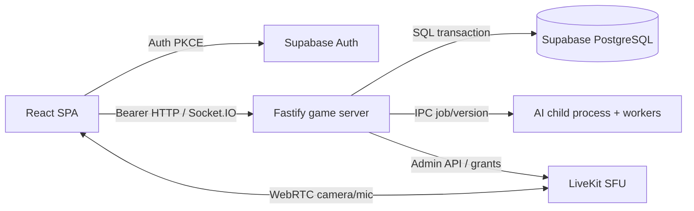

# Kiến trúc triển khai

## Quyết định cuối cùng

- React + TypeScript + Vite, React Router, CSS modules/SVG; không cần SSR.
- Node.js 24 LTS + TypeScript + Fastify + Socket.IO 4.x. Một instance server trong bản đồ án.
- Supabase PostgreSQL + Auth. Supabase CLI/Docker local, Supabase cloud khi deploy.
- SQL migrations bằng Supabase CLI, `pg` cho transaction backend; không thêm Prisma/Redis ở bản đầu.
- AI package TypeScript dùng cùng luật; child process riêng, worker thread tìm kiếm có cancel flag; tối đa 2 tìm kiếm đồng thời.
- LiveKit self-host local cho SFU; phòng media tách quyền theo source/audience, xem [media spec](06-MEDIA.md). Không đưa SFU vào Vercel/Render web service.
- Vitest, Playwright, ESLint, TypeScript strict, pnpm workspace. Node 24 LTS được xác nhận từ [Node releases](https://nodejs.org/en/about/previous-releases).

ISSUE-001 khóa exact phiên bản package tương thích và lockfile sau smoke build; ghi `docs/test-reports/toolchain.md`. Không lấy tag latest trong bản demo. Phiên bản thư viện chưa cài không được ghi như đã thử; lựa chọn major Node/Socket đã chốt, patch do executor kiểm chứng.

## Luồng dữ liệu



Tất cả dữ liệu ứng dụng qua backend; không kết hợp Supabase Realtime và Socket.IO cho cùng event. Client Supabase chỉ dùng Auth. Browser không truy cập app tables qua Data API; RLS deny-by-default là lớp bảo vệ nếu key publishable bị dùng trực tiếp.

Auth không dùng cookie cross-site Vercel↔Render. JWT Bearer trong header/socket auth, Supabase browser client sở hữu refresh. XSS là rủi ro chính của session JS: CSP, không HTML user, không log token. [Auth spec](05-AUTH.md) là source of truth thay nghiên cứu/phỏng vấn.

## Ranh giới module và file

```text
apps/web/src/
  app/{router.tsx,providers.tsx}
  lib/{api.ts,supabase.ts,socket.ts}
  features/{auth,friends,lobby,room,match,chat,media,ai,history}/
  components/board/{Board.tsx,Piece.tsx,coordinates.ts,board.module.css}
  styles/tokens.css
apps/server/src/
  app.ts                     # app factory; no listen on import
  main.ts                    # boot, shutdown, AI supervisor
  db/{pool.ts,transaction.ts}
  auth/{authenticate.ts,session.ts,routes.ts}
  modules/{friends,rooms,invitations,matches,chat,media,ai,history}/
  realtime/{gateway.ts,broadcast.ts,presence.ts}
apps/ai-worker/src/{main.ts,supervisor.ts,search-worker.ts,protocol.ts}
packages/contracts/src/{game.ts,api.ts,room.ts,media.ts,ai.ts,index.ts}
packages/game-rules/src/{initial.ts,position-key.ts,attacks.ts,moves.ts,terminal.ts,index.ts}
packages/ai/src/{evaluate.ts,ordering.ts,minimax.ts,search.ts,levels.ts,index.ts}
supabase/{config.toml,migrations/,seed.sql}
infra/{compose.yaml,livekit.yaml,Dockerfile.server,render.yaml}
tests/{fixtures,integration,e2e,load}/
docs/{specs,issues,handoff,planning,test-reports}/
```

Modules server có `service.ts`, `repository.ts`, `routes.ts`, test tương ứng khi cần; không tạo lớp base repository tổng quát. HTTP/socket gọi cùng service. Test clock inject; luật/AI thuần không biết DB/network. Các file vừa nêu là đích sẽ tạo, không phải mã có sẵn.

## Environment và lệnh thống nhất

Frontend public: `VITE_API_URL`, `VITE_SUPABASE_URL`, `VITE_SUPABASE_PUBLISHABLE_KEY`. Server private: `DATABASE_URL`, `SUPABASE_URL`, `SUPABASE_SECRET_KEY`, `SUPABASE_PUBLISHABLE_KEY`, `APP_ORIGIN`, `PORT`, `INVITE_HMAC_KEY`, `LIVEKIT_URL`, `LIVEKIT_API_KEY`, `LIVEKIT_API_SECRET`. Google client secret chỉ cấu hình provider Supabase. Không thêm private key prefix VITE.

Local mặc định web 5173, API 3001, Supabase CLI 54321/54322, LiveKit 7880 và cổng media theo config upstream. Vite proxy HTTP `/api` tiện dev nhưng client vẫn dùng API_URL cho socket; same bearer architecture trên deploy. `.env.example` chỉ value mẫu, không secret thật.

ISSUE-001 tạo root scripts: `pnpm dev`, `pnpm build`, `pnpm lint`, `pnpm typecheck`, `pnpm test:unit`, `pnpm test:integration`, `pnpm test:e2e`, `pnpm test:ai`, `pnpm test:load`. Tham số sau script được forward tới runner. `pnpm exec supabase start`, `pnpm exec supabase db reset` chỉ dùng project local/test; không reset DB cloud. `docker compose -f infra/compose.yaml up -d` khởi động media, không tạo Supabase thứ hai song song CLI.

## Triển khai

Vercel build static SPA, rewrite app routes về index.html. Render chạy Docker game server và child AI, bind PORT; remote database có SSL. Render hỗ trợ [WebSockets](https://render.com/docs/websocket); gói free có [spin-down](https://render.com/docs/free), vì vậy không hứa giữ ván qua restart. Kiểm thử restart theo INTERRUPTED, không dùng ping chống ngủ như giải pháp vận hành.

Media public cần LiveKit Cloud đã có tài khoản/allowance hoặc máy có UDP/TCP/TLS/TURN phù hợp. ISSUE-031 chọn Cloud làm cấu hình đích mặc định; dùng tài nguyên được người dùng cấp, không mua. Local đầy đủ không phụ thuộc tài khoản media cloud. Thiếu tài khoản chỉ chặn smoke triển khai tương ứng, không chặn issue local.

Tài liệu Vercel về WebSockets có thay đổi và khác nhau giữa các trang tại thời điểm khảo sát; thiết kế này không phụ thuộc vào nhận định “Vercel không hỗ trợ WebSocket”. Chúng ta chủ động chạy game backend lâu dài trên Render và frontend trên Vercel. Xem [Vercel hướng dẫn WebSockets](https://vercel.com/kb/guide/do-vercel-serverless-functions-support-websocket-connections).
