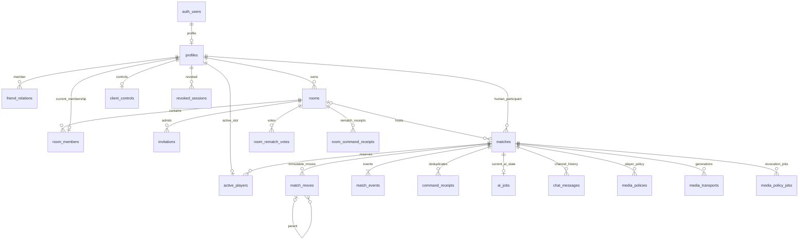

# Thiết kế cơ sở dữ liệu XIANGQI trên Supabase

**Phạm vi:** thiết kế cấu trúc, chưa tạo project, chưa chạy DDL/migration và chưa thay đổi Supabase. PostgreSQL + Supabase Auth; bản thiết kế `db-design-v1`, ngày 12/09/2026. Đây là nguồn chi tiết về schema cho agent viết migration ở ISSUE-006 và các issue mở rộng. Hành vi người dùng theo [01-PRODUCT](01-PRODUCT.md), transaction theo [03-STATE-MACHINES](03-STATE-MACHINES.md), DTO theo [04-CONTRACTS](04-CONTRACTS.md), auth/media theo [05](05-AUTH.md)/[06](06-MEDIA.md).

## 1. Các quyết định thiết kế

- **19 bảng do ứng dụng quản lý:** 18 bảng trong `public`, 1 bảng `private.revoked_sessions`. Supabase quản lý `auth.users`, `auth.identities`, `auth.sessions`; không tạo bản sao password, email verification, Google identity hoặc refresh token.
- Browser gọi Supabase chỉ cho Auth. Dữ liệu game/chat/hồ sơ qua backend Fastify → `pg` → PostgreSQL. Không cho browser đọc trực tiếp các bảng app; RLS và SQL grants bảo vệ đường Data API.
- Phòng (`room`) là nơi hai người chơi và tối đa5 người xem gặp nhau; ván (`match`) là một lần chơi. Một phòng có nhiều ván qua tái đấu; ván AI không có phòng.
- `room_members` chỉ chứa membership hiện tại. Lịch sử participant nằm cố định trong `matches`, không suy ra từ membership đã xóa.
- State bàn cờ dùng JSONB có schema, nước đi/event append-only để replay/audit; dữ liệu quan hệ và quyền dùng cột SQL/FK/CHECK. Không tách 90 ô thành 90 hàng rồi update riêng từng ô.
- Lưu **quyền và metadata media**, không lưu âm thanh/video/SDP/ICE hay JWT LiveKit. LiveKit truyền media; DB không lưu cuộc gọi.
- Giữ kiến trúc một game server và2 AI workers đã chốt. Không thêm bảng ranking, tournament, payment, neural model training hoặc notifications tổng quát ngoài phạm vi.

Những giả định vận hành không thay đổi tính năng: chưa có chức năng xóa tài khoản; mặc định giữ lịch sử ván cho replay, chat tự hết hạn30ngày. Không tự áp thời hạn xóa ván hoặc cascade xóa lịch sử khi admin xóa Auth user. Chính sách xóa tài khoản khi mở công khai cần được quyết định trước khi thêm chức năng đó.

## 2. Quy ước đọc từ điển dữ liệu

Mỗi bảng dưới ghi **cột – kiểu – NULL/default – ý nghĩa**. `NN` = NOT NULL; `NULL` = cho phép SQL NULL; `—` = không default, caller phải cấp. PK/UNIQUE/CHECK/FK là ràng buộc database, không chỉ validation frontend.

- UUID mới: backend sinh UUID cho transaction cần biết ID trước insert; có thể dùng default `gen_random_uuid()` cho ID độc lập. UUID từ Supabase giữ nguyên.
- Thời gian: `timestamptz`, default `now()` khi ghi mới; UTC, DTO epoch milliseconds. Deadline so với thời gian server thật lúc xử lý, không lấy timestamp client. Fake clock injection chỉ trong test.
- Counter/version: `bigint >= 0`; `pg` phải parse/serialize có kiểm tra `Number.isSafeInteger`, không cast mù chuỗi bigint thành number. ID/key/counter bất biến không cho client tự cập nhật.
- Enum nghiệp vụ dùng `text + CHECK IN (...)`, không PostgreSQL native enum ở bản đầu để đổi bằng migration dễ kiểm soát. Giá trị cụ thể liệt kê dưới đây.
- `created_at` bất biến; `updated_at` do backend cập nhật trong cùng transaction, không tự tăng version bằng timestamp trigger.
- FK mặc định `ON UPDATE RESTRICT ON DELETE RESTRICT`; ngoại lệ nêu rõ. Không dùng CASCADE từ room tới match/history. FK chưa được PostgreSQL tự tạo index ở phía tham chiếu phải được xem xét theo truy vấn thực.
- CHECK có thể nhận NULL và không từ chối hàng; mọi invariant bắt buộc phải gồm NN/`IS NOT NULL` hoặc `COALESCE(predicate,false)`. Chỉ kiểm `json->>'key' IN (...)` là chưa đủ khi key thiếu.

## 3. Danh mục bảng và quan hệ

| Nhóm | Bảng | Mục đích / owner đầu tiên |
|---|---|---|
| Tài khoản | profiles | Username/tên hiển thị,006/007/008 |
| Phiên | private.revoked_sessions | Bổ sung thu hồi session,006/007 |
| Bạn bè | friend_relations | Yêu cầu và kết bạn,006/009 |
| Phòng | rooms, room_members, invitations | Phòng, ghế, quyền vào qua mã/link/mời,006/010/011 |
| Ván | matches, active_players | Snapshot và một ván đang chơi/tài khoản,006/012 |
| Lịch sử | match_events, match_moves, command_receipts | Audit, nhánh undo, retry đúng một lần,006/012/014 |
| Kết nối | client_controls | Tab điều khiển/session/lease và offline,006/013 |
| AI | ai_jobs | Job hiện tại/cancel/deadline,006 khung/021 sử dụng |
| Chat | chat_messages | Hai kênh riêng theo match,006 khung/017 sử dụng |
| Media | media_policies, media_transports, media_policy_jobs | Quyền, generation và thu hồi bền vững,006 khung/025 sử dụng |
| Tái đấu | room_rematch_votes, room_command_receipts | Hai phiếu đồng ý và retry,027 thêm migration |

ERD là tổng quan; FK đôi RED/BLACK và các composite FK đầy đủ được quy định trong từng bảng. Không tự tạo bảng từ entity `auth_users`/`revoked_sessions` trong hình: tên SQL thực là `auth.users`/`private.revoked_sessions`.

## 4. Supabase Auth và profile

### 4.1. Các bảng thuộc Supabase

| Bảng quản lý bởi Supabase | Chỉ dùng những thông tin nào | Cách dùng |
|---|---|---|
| auth.users | id, trạng thái email/tài khoản qua Auth API | FK ứng dụng chỉ trỏ PK id; không thay schema Auth |
| auth.identities | Provider identity do Auth liên kết | Dùng Auth API, không tự tạo bảng google_accounts |
| auth.sessions | id và user_id để kiểm session JWT còn tồn tại | Private SECURITY DEFINER function, không cấp SELECT bảng này cho app_server |

Supabase khuyến cáo bảng profile riêng tham chiếu primary key `auth.users`; trigger signup phải được thử vì trigger lỗi có thể làm signup thất bại. Xem [quản lý user data](https://supabase.com/docs/guides/auth/managing-user-data). Kiểm tra session_id với Auth sessions là phần của [quản lý phiên](https://supabase.com/docs/guides/auth/sessions), không FK chặt vào các bảng session/identity nội bộ có vòng đời do provider quản lý.

### 4.2. `public.profiles`

| Cột | Kiểu | NULL/default | Ý nghĩa |
|---|---|---|---|
| user_id | uuid | NN, — | PK; FK auth.users(id) RESTRICT |
| username | text | NULL | Tên đăng nhập; null trong Google onboarding |
| display_name | text | NN, — | Tên UI Unicode1–40 ký tự sau trim |
| created_at | timestamptz | NN, now() | Ngày profile được tạo |
| updated_at | timestamptz | NN, now() | Lần sửa tên/onboarding |

**Khóa/ràng buộc:** PK(user_id); UNIQUE(username) cho phép nhiều SQL NULL; CHECK username null hoặc regex `^[a-z0-9_]{3,24}$`; CHECK `char_length(display_name) BETWEEN 1 AND 40 AND display_name=btrim(display_name)` và không blank. Không lưu email, password_hash, role từ client metadata. BEFORE UPDATE guard không đổi user_id; username chỉ được NULL→giá trị hợp lệ một lần hoặc giữ nguyên. Normalization username thực hiện trước insert; DB reject uppercase thay vì âm thầm đổi dữ liệu.

**Trigger tạo profile:** AFTER INSERT auth.users, security definer/search_path rỗng. Password signup kiểm metadata signup_username/signup_display_name; Google không có username thì null, display_name lấy tên đã trim/bounded hoặc fallback `Người chơi`. Metadata không cấp quyền. Profile chưa có username bị backend chặn nghiệp vụ; không cần cột onboarding_done có thể lệch username. Không lưu email_verified như cache dài hạn.

**Index:** UNIQUE username phục vụ login; thêm `(username text_pattern_ops)` để prefix `LIKE 'abc%'` ổn định theo collation. Không dùng tìm substring `%abc%` trong feature hiện tại.

### 4.3. `private.revoked_sessions`

| Cột | Kiểu | NULL/default | Ý nghĩa |
|---|---|---|---|
| session_id | uuid | NN, — | PK, claim session_id đã verify; không FK auth.sessions |
| user_id | uuid | NN, — | FK profiles.user_id |
| revoked_at | timestamptz | NN, now() | Thời điểm app xác nhận thu hồi |
| expires_at | timestamptz | NN, — | Mốc sớm nhất được xét dọn |

CHECK expires_at > revoked_at. Index(user_id), index(expires_at). Upsert retry không đổi user_id; không rút ngắn expires_at. Giữ ít nhất max(24h, JWT lifetime+60s), chỉ dọn khi Auth session không còn. Không lưu access/refresh token. Hàm `private.is_auth_session_active(p_session_id uuid,p_user_id uuid)` trả true chỉ khi Auth có đúng session/user **và không có revoked_sessions row tương ứng**; row vẫn chặn kể cả qua expires_at nhưng chưa đủ điều kiện cleanup. Trả false nếu không tồn tại, fail closed nếu truy vấn lỗi. Function SECURITY DEFINER, fully qualified relations, search_path rỗng; REVOKE EXECUTE từ PUBLIC/anon/authenticated, GRANT chỉ app_server. Owner migration có quyền đọc Auth, app_server không có quyền đó. Theo [database functions](https://supabase.com/docs/guides/database/functions), security-definer phải cấu hình quyền và search_path rõ.

## 5. Bạn bè, phòng và quyền tham gia

### 5.1. `public.friend_relations`

| Cột | Kiểu | NULL/default | Ý nghĩa |
|---|---|---|---|
| id | uuid | NN, gen_random_uuid() | PK cho request API |
| user_low | uuid | NN, — | FK profiles, UUID nhỏ hơn |
| user_high | uuid | NN, — | FK profiles, UUID lớn hơn |
| requester_id | uuid | NN, — | FK profiles, người gửi |
| status | text | NN, PENDING | PENDING hoặc ACCEPTED |
| created_at | timestamptz | NN, now() | Thời điểm gửi |
| accepted_at | timestamptz | NULL | Thời điểm đồng ý |

UNIQUE(user_low,user_high); CHECK user_low < user_high, requester_id IN(user_low,user_high); status ACCEPTED iff accepted_at IS NOT NULL, accepted_at >= created_at nếu có. Reject/cancel/unfriend xóa row sau kiểm đúng actor; lần kết bạn sau là request mới. Không cần lưu trạng thái REJECTED mãi vì chưa có feature lịch sử kết bạn. Gửi chéo trả row hiện có, không tự accept. Index(user_low,status,created_at DESC,id), (user_high,status,created_at DESC,id) phục vụ hai phía.

### 5.2. `public.rooms`

| Cột | Kiểu | NULL/default | Ý nghĩa |
|---|---|---|---|
| id | uuid | NN, gen_random_uuid() | PK |
| owner_id | uuid | NN, — | FK profiles; bất biến |
| name | text | NN, — | Tên phòng trim1–60 |
| visibility | text | NN, PUBLIC | PUBLIC / CODE_ONLY / LOCKED |
| status | text | NN, WAITING | WAITING / PLAYING / FINISHED / CLOSED |
| room_version | bigint | NN, 0 | Version membership/settings/ready/lifecycle |
| current_match_id | uuid | NULL | Match hiện tại/gần nhất, không xóa khi đóng |
| time_control | smallint | NN, 0 | 0 / 300 / 600 / 900 giây mỗi side |
| watch_epoch | bigint | NN, 0 | Thu hồi cohort viewer/mã xem |
| created_at | timestamptz | NN, now() | Ngày tạo |
| finished_at | timestamptz | NULL | Mốc FINISHED để auto-close10phút |
| closed_at | timestamptz | NULL | Đóng nghiệp vụ, không xóa row |

CHECK trim/name length, enum/counters. WAITING: current_match_id và finished_at null; PLAYING: current_match_id NN, finished_at null; FINISHED: current_match_id và finished_at NN; CLOSED: closed_at NN, giữ current_match_id/finished_at cuối nếu có. Trạng thái khác CLOSED yêu cầu closed_at null. Lifecycle service không đưa room đã có match về WAITING.

**FK vòng:** thêm sau tạo matches: `(current_match_id,id) REFERENCES matches(id,room_id)` MATCH SIMPLE DEFERRABLE INITIALLY IMMEDIATE. UNIQUE matches(id,room_id) là đích FK; cột current_match_id null cho phép phòng mới. Composite FK ngăn room A trỏ match thuộc B hoặc AI (xem invariant AI room_id null ở matches; FK tới pair nonnull không khớp). Không chỉ FK đơn match ID. Owner là PLAYER membership khi room mở do transaction; không FK owner tới membership để tránh lịch sử room phụ thuộc row đã xóa.

**Index:** `(created_at DESC,id DESC) WHERE visibility='PUBLIC' AND status<>'CLOSED'` cho sảnh; `(finished_at,id) WHERE status='FINISHED'` cho cleanup; `(owner_id)` để kiểm quan hệ/admin vận hành. room_version tăng khi current_match_id/start/end/close thay đổi, không chỉ settings.

### 5.3. `public.room_members`

| Cột | Kiểu | NULL/default | Ý nghĩa |
|---|---|---|---|
| room_id | uuid | NN, — | FK rooms |
| user_id | uuid | NN, — | FK profiles |
| role | text | NN, — | PLAYER / SPECTATOR |
| side | text | NULL | RED / BLACK chỉ cho PLAYER |
| ready | boolean | NN, false | Chỉ PLAYER trước start |
| admission_epoch | bigint | NN, — | Viewer nhận rooms.watch_epoch lúc vào; player0 |
| joined_at | timestamptz | NN, now() | Ngày vào |
| disconnected_at | timestamptz | NULL | Mốc offline membership; viewer giữ15s |

PK(room_id,user_id); UNIQUE(user_id) = một current room/tài khoản; UNIQUE(room_id,side) = mỗi side một player, nhiều NULL cho viewer. CHECK `(role='PLAYER' AND side IS NOT NULL AND side IN('RED','BLACK') AND admission_epoch=0) OR (role='SPECTATOR' AND side IS NULL AND ready=false AND admission_epoch>=0)`.

**Trần5 người xem:** đếm SPECTATOR dưới room row lock rồi insert; không viết CHECK chứa subquery/count. Cùng transaction kiểm room visibility/grant/watch_epoch và user active slot. PUBLIC→CODE_ONLY/LOCKED hoặc rotate watch code: tăng watch_epoch, remove toàn bộ spectator memberships, revoke subscriptions và enqueue media job. Giữ slot offline15s bằng chưa xóa row, không cộng thêm record khi reconnect. PLAYER không chuyển role tại chỗ.

PK đủ prefix room để đếm; index(disconnected_at) WHERE role='SPECTATOR' AND disconnected_at IS NOT NULL cho cleanup. Hai side khi rematch: UNIQUE(room_id,side) đặt DEFERRABLE INITIALLY IMMEDIATE, riêng transaction swap SET CONSTRAINTS constraint-name DEFERRED; không tạm gán side=NULL trái CHECK. Tuyệt đối không dùng partial unique không deferrable cho constraint cần đổi hai side này.

### 5.4. `public.invitations`

| Cột | Kiểu | NULL/default | Ý nghĩa |
|---|---|---|---|
| id | uuid | NN, gen_random_uuid() | PK |
| room_id | uuid | NN, — | FK rooms |
| sender_id | uuid | NN, — | FK profiles |
| recipient_id | uuid | NULL | FK profiles; có giá trị cho direct invite |
| role | text | NN, — | PLAY / WATCH; khác enum PLAYER/SPECTATOR |
| token_hash | bytea | NULL | HMAC-SHA256 token link,32bytes |
| code_hash | bytea | NULL | HMAC-SHA256 mã8ký tự,32bytes |
| status | text | NN, ACTIVE | ACTIVE / CONSUMED / DECLINED / REVOKED / EXPIRED |
| epoch | bigint | NN, 0 | WATCH theo room.watch_epoch; PLAY0 |
| created_at | timestamptz | NN, now() | Ngày cấp |
| expires_at | timestamptz | NN, — | Direct10phút, share24h |
| resolved_at | timestamptz | NULL | Thời điểm terminal |
| consumed_by | uuid | NULL | FK profiles, chỉ PLAY consumed |

CHECK direct: recipient_id NN, role PLAY, cả2hash NULL, recipient khác sender. Share: recipient_id NULL, cả token_hash/code_hash NN. Hash phải octet_length32. WATCH không CONSUMED/DECLINED; DECLINED chỉ direct. CONSUMED iff consumed_by NN; direct consumed_by=recipient_id. ACTIVE iff resolved_at NULL; terminal phải resolved_at NN. expires_at > created_at, epoch>=0, role PLAY epoch0. WATCH grant reusable tới expiry/rotation/close; không đổi thành consumed sau viewer đầu tiên.

UNIQUE partial(code_hash) WHERE status='ACTIVE' AND code_hash IS NOT NULL; tương tự token_hash; direct pending UNIQUE(room_id,recipient_id) WHERE status='ACTIVE' AND recipient_id IS NOT NULL. Index(recipient_id,created_at DESC,id DESC) WHERE recipient_id IS NOT NULL; index(room_id,status); index(expires_at) WHERE status='ACTIVE'. Không dùng `expires_at > now()` trong index predicate. Service luôn kiểm timestamp dù scheduler chưa mark EXPIRED; nếu sinh mã va chạm row đã hết hạn nhưng vẫn ACTIVE, mark EXPIRED dưới lock rồi retry, không nới uniqueness.

Không lưu raw code/token. HMAC input dùng domain `code:` hoặc `token:` chung cho cả PLAY/WATCH, không chứa role; role kiểm từ row sau lookup. Nhờ vậy raw code duy nhất giữa mọi active grant, không vô tình cho PLAY và WATCH cùng mã. Secret INVITE_HMAC_KEY ở server, không DB. Rotation secret chủ động revoke toàn bộ active grants; không tự thay secret khi restart.

## 6. Ván, lịch sử và idempotency

### 6.1. `public.matches`

| Cột | Kiểu | NULL/default | Ý nghĩa |
|---|---|---|---|
| id | uuid | NN, gen_random_uuid() | PK |
| room_id | uuid | NULL | FK rooms; null ở AI |
| mode | text | NN, — | ONLINE / AI |
| status | text | NN, ACTIVE | ACTIVE / FINISHED / INTERRUPTED |
| red_user_id | uuid | NULL | FK profiles; null khi RED là AI |
| black_user_id | uuid | NULL | FK profiles; null khi BLACK là AI |
| ai_side | text | NULL | RED / BLACK ở mode AI |
| ai_level | text | NULL | EASY / MEDIUM / HARD ở AI |
| position | jsonb | NN, — | Position sau mutation gần nhất |
| version | bigint | NN, 0 | Phiên bản authoritative, không giảm khi undo |
| ply | integer | NN, 0 | Số nước nhánh hiệu lực |
| time_control | smallint | NN, 0 | Bản chụp0/300/600/900, bất biến |
| clock | jsonb | NULL | ClockState; chỉ NULL khi unlimited |
| rule_set_version | text | NN, xiangqi-simple-v1 | Luật dùng tái dựng initial/replay |
| outcome | jsonb | NULL | Winner/reason terminal |
| active_move_ids | jsonb | NN, [] | Mảng UUID theo nhánh hiện tại |
| repetition_counts | jsonb | NN, — | Key vị trí+turn → số lần trên nhánh |
| proposal | jsonb | NULL | DRAW/UNDO pending, tối đa một |
| boot_id | uuid | NN, — | Process generation tạo/quản lý ACTIVE |
| created_at | timestamptz | NN, now() | Bắt đầu ván |
| ended_at | timestamptz | NULL | Kết thúc hoặc interrupted |

**Mode CHECK (mọi nhánh chống NULL):** ONLINE có room_id, red_user_id, black_user_id NN, hai người khác nhau; ai_side/ai_level NULL. AI có room_id NULL, ai_level hợp lệ NN; ai_side RED iff red_user_id NULL và black_user_id NN; ai_side BLACK iff black_user_id NULL và red_user_id NN. Không tạo một tài khoản Auth giả cho AI.

**State CHECK:** ACTIVE outcome/ended_at NULL; terminal outcome object/ended_at NN. Mapping reason/status/winner theo03: interrupted reasons BOTH_OFFLINE/SERVER_RESTART/AI_UNAVAILABLE winner JSON null; hòa FINISHED AGREED_DRAW/REPETITION winner JSON null; các kết thúc khác FINISHED winner RED/BLACK NN. SQL NULL outcome khác JSON object có winner:null. ended_at>=created_at. version/ply>=0; CHECK rule_set_version='xiangqi-simple-v1' trong bản này (thêm version cần migration/reader tương ứng); số phần tử active_move_ids=ply; clock null iff time_control0; terminal proposal NULL, AI proposal NULL.

**Khóa/index:** UNIQUE(id,room_id) đích composite FK; UNIQUE partial(room_id) WHERE status='ACTIVE' AND room_id IS NOT NULL; history `(red_user_id,created_at DESC,id DESC)` WHERE red_user_id IS NOT NULL và tương tự black; `(boot_id,id) WHERE status='ACTIVE'` cho boot recovery; `(room_id,created_at DESC,id DESC)` cho lịch sử trong phòng. Không GIN toàn bộ JSON vì không có truy vấn sản phẩm cần tìm tùy ý trong bàn.

Guard trigger: room_id/mode/human participants/ai_side/ai_level/time_control/rule_set_version/created_at bất biến sau INSERT; terminal match không sửa snapshot/version hoặc quay ACTIVE. Proposal/clock thay đổi chỉ trong ACTIVE transaction. Không cần trigger tự sinh event; service/finalizer là một nơi ghi sự kiện.

### 6.2. `public.active_players`

| Cột | Kiểu | NULL/default | Ý nghĩa |
|---|---|---|---|
| user_id | uuid | NN, — | PK, FK profiles; một slot active |
| match_id | uuid | NN, — | FK matches |
| acquired_at | timestamptz | NN, now() | Thời điểm claim |

Index(match_id). Slot chỉ cho human participant; ONLINE2row, AI1row. Insert cùng transaction start, delete cùng finalizer. Một UNIQUE user_id ngăn hai ván online/AI active; service kiểm participant/status trước insert. FK không thể tự chứng minh match ACTIVE. Nếu DB rollback không được giữ slot. Không suy ra active từ socket đang mở.

### 6.3. `public.match_moves`

| Cột | Kiểu | NULL/default | Ý nghĩa |
|---|---|---|---|
| id | uuid | NN, gen_random_uuid() | PK move |
| match_id | uuid | NN, — | FK matches |
| parent_move_id | uuid | NULL | Move trước trong cùng nhánh; null cho ply1 |
| event_version | bigint | NN, — | Version MOVE đã tạo record |
| side | text | NN, — | RED / BLACK |
| move | jsonb | NN, — | `{from:{x,y},to:{x,y}}` |
| search_meta | jsonb | NULL | Chỉ AI: kết quả search giới hạn theo mục JSON |
| created_at | timestamptz | NN, now() | Thời điểm chấp nhận |

UNIQUE(match_id,id); UNIQUE(match_id,event_version); FK(match_id,parent_move_id)→match_moves(match_id,id) MATCH SIMPLE; CHECK parent khác id, event_version>0, side đúng enum. Composite FK ngăn parent của ván khác. FK(match_id,event_version)→match_events(match_id,version) DEFERRABLE INITIALLY DEFERRED để event/move insert cùng transaction. Service xác nhận event type MOVE, parent có event_version nhỏ hơn con, parent là tip đang hiệu lực; không tin FK đơn để ngăn chu trình. Tạo parent cũ hơn và cấm UPDATE bảo đảm ancestry không tạo vòng qua write hợp lệ.

Append-only: app_server chỉ SELECT/INSERT, không UPDATE/DELETE; không xóa nhánh bị undo. search_meta không chứa token hoặc toàn bộ cây search. Index(match_id,parent_move_id) phục vụ audit; PK/UNIQUE đủ cho replay theo ID.

### 6.4. `public.match_events`

| Cột | Kiểu | NULL/default | Ý nghĩa |
|---|---|---|---|
| id | uuid | NN, gen_random_uuid() | PK audit event |
| match_id | uuid | NN, — | FK matches |
| version | bigint | NN, — | UNIQUE trong match |
| type | text | NN, — | START / MOVE / UNDO / PROPOSAL_CREATED / PROPOSAL_RESOLVED / RESULT |
| payload | jsonb | NN, — | Discriminated payload theo03/04 |
| created_at | timestamptz | NN, now() | Ngày ghi |

UNIQUE(match_id,version), CHECK version>=0, START iff version0, payload object. Một MOVE terminal chứa outcome trong cùng event, không ghi RESULT thứ hai. Không UPDATE/DELETE qua app_server. (match_id,version) phục vụ stream audit theo thứ tự; không cần index created_at độc lập. Event không lưu camera/chat/token và không dùng làm broadcast nguyên xi.

### 6.5. `public.command_receipts`

| Cột | Kiểu | NULL/default | Ý nghĩa |
|---|---|---|---|
| match_id | uuid | NN, — | FK matches |
| actor_key | text | NN, — | `USER:<uuid canonical>` hoặc `AI` |
| command_id | uuid | NN, — | Idempotency ID client/job |
| command_type | text | NN, — | MOVE / RESIGN / PROPOSE / RESPOND / UNDO_AI |
| payload_hash | bytea | NN, — | SHA256 canonical(type,expectedVersion,payload),32bytes |
| applied_version | bigint | NN, — | Version sự kiện đã commit |
| result | jsonb | NN, — | Metadata cố định của ack, không lưu fresh snapshot |
| created_at | timestamptz | NN, now() | Ngày ghi |

PK(match_id,actor_key,command_id); FK(match_id,applied_version)→match_events(match_id,version) DEFERRABLE INITIALLY DEFERRED; CHECK hash32bytes, applied_version>0, actor format. actor USER phải là participant đã authenticate ở service; AI chỉ internal path. `result` shape `{kind:'APPLIED'|'DEADLINE_FINALIZED',errorCode:null|'MATCH_ENDED'}`; DEADLINE_FINALIZED khi request kích hoạt timeout đã commit nhưng requested mutation bị từ chối. Retry APPLIED trả CommandResult với applied_version gốc và snapshot hiện tại sau access/deadline checks. Retry DEADLINE_FINALIZED trả MATCH_ENDED theo ApiResult error chuẩn, không bịa snapshot trong error DTO; client gọi sync để lấy trạng thái mới. Không trả timestamp/clock từ receipt. Scheduler không cần receipt nếu không có client command; unique version+match lock bảo vệ callback lặp.

Append-only SELECT/INSERT. Cùng ID/hash retry không thêm event; khác hash COMMAND_ID_REUSED. Không FK actor_key vào Auth vì chứa AI; không dùng user_id từ payload làm actor. Giữ receipt cùng lịch sử match để retry cũ không bị hiểu thành lệnh mới.

## 7. Tab điều khiển và AI job

### 7.1. `public.client_controls`

| Cột | Kiểu | NULL/default | Ý nghĩa |
|---|---|---|---|
| user_id | uuid | NN, — | PK, FK profiles |
| room_id | uuid | NULL | Room context online |
| match_id | uuid | NULL | Active match; AI không có room |
| controller_id | uuid | NN, — | Secret lease token đổi khi takeover |
| controller_tab_id | uuid | NN, — | Tab được điều khiển, không coi là auth |
| session_id | uuid | NN, — | Auth session đã verify, không FK auth.sessions |
| control_epoch | bigint | NN, 1 | Phiên điều khiển tăng khi takeover |
| lease_until | timestamptz | NN, — | Heartbeat gia hạn30s |
| disconnected_at | timestamptz | NULL | Offline của controller |
| updated_at | timestamptz | NN, now() | Lần heartbeat/context update |

UNIQUE(controller_id); CHECK control_epoch>=1, room_id IS NOT NULL OR match_id IS NOT NULL. FK(room_id,user_id)→room_members(room_id,user_id) MATCH SIMPLE ON DELETE CASCADE để xóa lease online khi rời; FK match_id→matches; FK(match_id,room_id)→matches(id,room_id) MATCH SIMPLE kiểm hai ID nếu cùng có. AI room null phải kiểm mode/participant bằng service. Index(session_id), index(lease_until), index(match_id) WHERE match_id IS NOT NULL.

WAITING/FINISHED room: room_id có, match_id null; ACTIVE online cập nhật match_id cho các member. AI active chỉ match_id; khi AI terminal xóa control context, lịch sử vẫn đọc bằng participant auth. Sau terminal online giữ room context nhưng clear match_id. Tạo/join room sau AI terminal không bị lease cũ giữ chỗ.

Online/offline bạn bè tính từ **mọi authenticated socket đang còn lease** trong memory của server một instance, không phải sự có mặt của row này. Grace chơi tính controller của human, observer tab không kéo dài thời gian. Viewer membership offline tính khi không còn socket hợp lệ của tài khoản trong room; controller mất nhưng observer còn thì giữ ghế/read, yêu cầu takeover trước gửi chat/media. Không viết updated_at mỗi frame video.

### 7.2. `public.ai_jobs`

Thiết kế **một row trạng thái hiện tại trên mỗi AI match**, không một row mới cho mỗi node/search. `id` là ID lần search hiện tại/gần nhất, còn PK ổn định là match_id; điều này làm job_version tăng xuyên nhiều lượt mà không cần counter cạnh tranh ở matches.

| Cột | Kiểu | NULL/default | Ý nghĩa |
|---|---|---|---|
| match_id | uuid | NN, — | PK, FK matches |
| id | uuid | NULL | UNIQUE job token, null trước search đầu |
| expected_version | bigint | NULL | Snapshot version search đầu vào |
| status | text | NN, IDLE | IDLE / QUEUED / THINKING / FAILED |
| job_version | bigint | NN, 0 | Tăng mỗi lần đổi job/state |
| attempts | smallint | NN, 0 | Dispatch attempts0..2; một retry crash |
| queued_at | timestamptz | NULL | Vào hàng đợi |
| started_at | timestamptz | NULL | Worker bắt đầu attempt gần nhất |
| completed_at | timestamptz | NULL | Kết thúc/discard/cancel job gần nhất |
| deadline_at | timestamptz | NULL | Wall deadline để chuyển sang worker duration |
| last_error_code | text | NULL | Mã lỗi đã sanitize, không stack/token |

CHECK job_version>=0, attempts0..2; id/expected_version/queued_at/deadline_at cùng null trước job đầu (status IDLE, attempts0), hoặc cùng NN sau khi có job; expected_version>=0. QUEUED/THINKING đòi id NN/completed_at NULL; THINKING started_at NN/attempts>=1; FAILED completed_at NN; IDLE sau job giữ metadata và completed_at NN. Timestamp không âm thứ tự; retry về QUEUED được reset started_at, vẫn giữ cùng id/expected_version để late result cũ không thành hai nước.

Index(status,queued_at,match_id) WHERE status IN('QUEUED','THINKING'); UNIQUE(id) không chặn nhiều NULL. Match là AI và đến lượt máy phải được service kiểm. Queue8/running2 do supervisor reservation, không CHECK cross-row. jobVersion trong DTO độc lập match.version. IDLE/FAILED snapshot jobId có thể là job gần nhất, trước job đầu null; client dùng jobVersion chứ không chỉ so UUID. Khi tạo job mới replace id, tăng job_version; worker result kèm id/expected_version, service reject nếu không còn khớp hoặc ván hết. Các search stats theo nước đã áp dụng nằm ở match_moves.search_meta, benchmark dataset ở file Git, không bảng training.

## 8. Chat tách kênh

### 8.1. `public.chat_messages`

| Cột | Kiểu | NULL/default | Ý nghĩa |
|---|---|---|---|
| id | uuid | NN, gen_random_uuid() | PK message |
| room_id | uuid | NN, — | FK rooms |
| match_id | uuid | NN, — | Ván hiện tại khi gửi |
| sender_id | uuid | NN, — | FK profiles |
| channel | text | NN, — | PLAYERS / SPECTATORS do server chọn |
| client_message_id | uuid | NN, — | ID retry từ client |
| content | text | NN, — | Plain Unicode text1–1000, sau trim không blank |
| created_at | timestamptz | NN, now() | Thời điểm server nhận |

FK(match_id,room_id)→matches(id,room_id), ngăn chat AI hoặc trỏ sai phòng. UNIQUE(match_id,sender_id,client_message_id); CHECK channel enum, char_length1..1000, btrim(content) khác rỗng. Nội dung hiển thị text escaped, không lưu HTML được tin cậy. Cùng ID/content retry trả message gốc; cùng ID khác content reject COMMAND_ID_REUSED, không overwrite. Membership/controller hiện tại vẫn kiểm trước trả receipt/message cũ.

Index(room_id,match_id,channel,created_at DESC,id DESC) phục vụ cursor50; index(created_at,id) phục vụ retention30ngày. Không FK sender vào room_members vì người gửi có thể đã rời. Backend không cho đọc chéo dù owner; row tồn tại không có nghĩa mọi member được đọc. Chat hiện có chỉ sau khi đã có match; WAITING trước ván đầu hiển thị chat chưa bắt đầu, không tạo match giả cho chat. FINISHED chat tới room close; rematch đổi match_id, không trộn lịch sử cũ vào kênh mới.

Không bảng chat_rooms riêng: room+match+channel đủ xác định hai kênh. Không attachments hoặc Storage bucket cuộc gọi.

## 9. Camera/microphone: quyền, thế hệ và job thu hồi

### 9.1. `public.media_policies`

| Cột | Kiểu | NULL/default | Ý nghĩa |
|---|---|---|---|
| match_id | uuid | NN, — | FK matches |
| user_id | uuid | NN, — | FK profiles, chỉ hai human players |
| camera_audience | text | NN, OFF | Desired camera |
| microphone_audience | text | NN, OFF | Desired microphone |
| policy_version | bigint | NN, 0 | Một counter/cặp camera+mic/user |
| applied_camera_audience | text | NN, OFF | Cấu hình camera được SFU xác nhận |
| applied_microphone_audience | text | NN, OFF | Cấu hình mic được xác nhận |
| applied_version | bigint | NN, 0 | Version áp dụng xong |
| status | text | NN, APPLIED | APPLYING / APPLIED |
| epoch | bigint | NN, 0 | Tăng mỗi khi reset media/control |
| updated_at | timestamptz | NN, now() | Lần đổi desired/applied |

PK(match_id,user_id); mọi audience ∈ OFF/OPPONENT_ONLY/OPPONENT_AND_SPECTATORS. CHECK 0<=applied_version<=policy_version, epoch>=0. APPLIED yêu cầu versions bằng nhau và desired=applied cả2mục; APPLYING có thể version bằng nhau khi đang rotate do viewer/membership đổi mà audience không đổi. Không suy ra applied từ desired trước SFU ACK.

Service đảm bảo match ONLINE, user là participant; viewer không có policy row. Hai update camera/mic cùng expected policy_version chỉ một thành công; B có version riêng không bị A ghi đè. Reset cả2OFF tăng version một lần, epoch một lần. Không UNIQUE user_id toàn cục vì giữ policy lịch sử nhiều ván. PK đã đủ lookup match; không cần index riêng theo audience.

### 9.2. `public.media_transports`

**Chi tiết bổ sung so với blueprint ban đầu:** giữ một row **mỗi generation**, không overwrite room_name của generation cũ. Nếu crash sau đổi tên nhưng trước DeleteRoom, overwrite sẽ làm mất địa chỉ cần thu hồi. Mỗi tuple match/kind/audience chỉ một generation còn phục vụ/đang thu hồi.

| Cột | Kiểu | NULL/default | Ý nghĩa |
|---|---|---|---|
| match_id | uuid | NN, — | FK matches |
| kind | text | NN, — | CAMERA / MICROPHONE |
| audience | text | NN, — | PRIVATE / WATCH, không phải Audience enum UI |
| generation | bigint | NN, — | Counter>=1 cho tuple |
| room_name | text | NN, — | Tên opaque có nonce128bit, không tái sử dụng |
| status | text | NN, READY | READY / ROTATING / RETIRED |
| created_at | timestamptz | NN, now() | Lần ghi generation |
| retired_at | timestamptz | NULL | Sau ACK thu hồi đã được persist |

PK(match_id,kind,audience,generation); UNIQUE(room_name) toàn lịch sử; UNIQUE partial(match_id,kind,audience) WHERE status IN('READY','ROTATING'). CHECK enum/generation>0; RETIRED iff retired_at NN. Không xóa tên cũ để dùng lại. Chỉ READY được cấp token; ROTATING chặn cấp cho tuple. Sau DeleteRoom ACK, transaction mark cũ RETIRED và insert generation mới READY; match đã end thì chỉ retire, không tạo mới. Index(status,match_id) WHERE status='ROTATING' để recovery.

Không lưu JWT/url credential; LIVEKIT_URL là config môi trường. Server cấp source grants theo06. FK không bảo đảm đây là online match, service kiểm. Nếu SFU thành công nhưng DB commit ACK fail, retry DeleteRoom cũ idempotent rồi ghi lại; không đánh dấu READY mới trước xác nhận.

### 9.3. `public.media_policy_jobs`

Một job chưa giải quyết/match; serialize external effects cho cả A/B. Dùng **desired_versions của hai người**, không dùng một scalar desired_version vô nghĩa giữa version A và B. Membership/control revocation có target epoch riêng, không giả tăng version người khác.

| Cột | Kiểu | NULL/default | Ý nghĩa |
|---|---|---|---|
| id | uuid | NN, gen_random_uuid() | PK job |
| match_id | uuid | NN, — | FK matches |
| reason | text | NN, — | POLICY / MEMBERSHIP / CONTROL / END / RESTART |
| desired_versions | jsonb | NN, [] | Tối đa2 `{userId,policyVersion,epoch}` |
| target_watch_epoch | bigint | NN, — | Epoch room tại lúc enqueue/coalesce |
| target_controls | jsonb | NN, [] | Tối đa7 `{userId,controlEpoch}` |
| effects | jsonb | NN, [] | Kế hoạch effects tối đa4 tuple đang xử lý, theo mục JSON |
| status | text | NN, PENDING | PENDING / RUNNING / RETRY / FAILED / SUCCEEDED |
| attempts | smallint | NN, 0 | Lần thực thi của retry cycle0..4 |
| next_attempt_at | timestamptz | NULL | Due time, null nếu không chờ retry |
| last_error | text | NULL | Mã/tóm tắt sanitize, giới hạn1000ký tự |
| created_at | timestamptz | NN, now() | Thời điểm enqueue |
| updated_at | timestamptz | NN, now() | Coalesce/claim/effect ACK |
| completed_at | timestamptz | NULL | Chỉ SUCCEEDED |

UNIQUE partial(match_id) WHERE status<>'SUCCEEDED'; kể cả FAILED phải được đối soát, không tạo job mới để bỏ qua effect cũ. CHECK attempts0..4, epochs>=0, enum, completed_at NN iff SUCCEEDED; RETRY next_attempt_at NN; các status khác next_attempt_at NULL. Index(next_attempt_at,id) WHERE status='RETRY'; index(match_id,created_at DESC,id DESC) cho audit; không index JSON trừ khi có truy vấn thực.

Trước SFU call persist effects đủ roomName/identity/generation; sau ACK persist checkpoint. Coalesce request mới cập nhật target versions/epochs trong job đang mở, **không xóa effects chưa xử lý**. Khi đang RUNNING, runner giữ effect batch bất biến, hoàn tất batch rồi đọc targets mới và lập batch tiếp. Room/match lock ngắn cho authorize/coalesce/claim/finalize; một runner/match trong server một instance; không giữ transaction SQL suốt cuộc gọi mạng. Request END/RESTART là terminal intent ưu tiên, không bị POLICY cũ mở lại media.

Retry3lần sau initial attempt:1/2/5giây (attempts tối đa4). FAILED giữ APPLYING/chặn grants liên quan; khi SFU phục hồi, recovery tiếp tục **cùng job/effects**, bắt đầu retry cycle mới có ghi nhận updated_at, không quên tên cũ. Chỉ SUCCEEDED khi mọi effect cần thiết đã ACK và target versions/epochs còn khớp. Nếu targets đổi thì tiếp tục cùng job, chưa APPLIED. `effects` là kế hoạch bù trừ có cấu trúc, không phải log tùy ý hoặc nơi chứa token. Không cần hàng outbox chung cho game broadcast: game sync snapshot đã giải quyết mất event, chỉ media cần durable side-effect work.

## 10. Đồng ý tái đấu và chống tạo trùng ván

### 10.1. `public.room_rematch_votes`

| Cột | Kiểu | NULL/default | Ý nghĩa |
|---|---|---|---|
| room_id | uuid | NN, — | FK rooms |
| match_id | uuid | NN, — | Vòng cũ được đề nghị tái đấu |
| user_id | uuid | NN, — | FK profiles |
| created_at | timestamptz | NN, now() | Thời điểm đồng ý |

PK(room_id,match_id,user_id); FK(match_id,room_id)→matches(id,room_id). Row tồn tại = accept=true; accept=false xóa cả2vote vòng hiện tại. Service kiểm đúng hai player của match và membership hiện tại, không cho spectator vote. Start new match/close xóa votes. Không FK user vào membership để định nghĩa quyền lịch sử; authorization làm trước mutation. PK đủ prefix room; không thêm counter vote_count dễ lệch.

### 10.2. `public.room_command_receipts`

| Cột | Kiểu | NULL/default | Ý nghĩa |
|---|---|---|---|
| room_id | uuid | NN, — | FK rooms |
| actor_id | uuid | NN, — | FK profiles |
| command_id | uuid | NN, — | UUID retry |
| command_type | text | NN, REMATCH | CHECK chỉ REMATCH |
| expected_match_id | uuid | NN, — | Vòng cũ trong request |
| payload_hash | bytea | NN, — | SHA256(type,expectedMatchId,accept),32bytes |
| new_match_id | uuid | NULL | Ván tạo bởi chính command; null nếu chỉ vote/reject |
| created_at | timestamptz | NN, now() | Ngày commit |

PK(room_id,actor_id,command_id); composite FK(expected_match_id,room_id) và (new_match_id,room_id)→matches(id,room_id); hash32bytes; new_match_id null hoặc khác expected_match_id. SELECT/INSERT only. FK không ép row đang current vì retry phải còn tồn tại sau đổi vòng. Same request trả newMatchId gốc + room DTO hiện tại sau auth; không sửa receipt vote đầu thành receipt tạo ván của người thứ hai. Request ID mới với vòng cũ trả CONFLICT. Index theo các FK match khi cần cleanup/history audit; room PK prefix đủ lookup receipt.

## 11. JSONB schemas và nguồn dữ liệu chuẩn

| Cột / cấu trúc | Shape và invariant | Ai kiểm |
|---|---|---|
| matches.position | `{board:(Piece|null)[90],turn:'RED'|'BLACK'}`; Piece `{id,type,side}`, đúng enums04 | DB CHECK object/board array90/turn; Zod + luật kiểm mỗi piece/ID unique/an toàn tướng |
| matches.clock | SQL NULL unlimited, hoặc `{redMs,blackMs,runningSinceEpochMs}` số nguyên không âm | DB shape/key/type/range, service settle đúng side/deadline |
| matches.outcome | Object `{winner:Side|null,reason:OutcomeReason}` terminal | DB required keys/status mapping với NULL-safe expression, service chứng minh luật |
| matches.active_move_ids | Array UUID text, độ dài=ply, không trùng | DB array/length, service UUID/unique/ancestry cùng match |
| matches.repetition_counts | Object canonical positionKey → positive integer; initial key count1 | DB object; service rebuild từ initial+effectiveMoves, path-aware AI |
| matches.proposal | SQL NULL hoặc04 Proposal đủ UUID/kind/requester/basePly/createdVersion/expiresAtMs | DB object/kind/AI-null; service requester participant/base version/30s |
| match_moves.move | from/to integer x0..8,y0..9, khác nhau | DB shape/range; luật hợp lệ ở service |
| match_moves.search_meta | SQL NULL human; AI `{algorithm,seed,nodes,completedDepth,elapsedMs,score,pv,aborted,engineVersion}` | Zod bounds, pv tối đa depth cap cấu hình; không lưu cây search |
| match_events.payload | Payload theo type03; START initial+rules, MOVE move info+outcome optional, RESULT actor+outcome, UNDO ancestry, proposal state | DB object; contracts discriminated union, service event-version consistency |
| command_receipts.result | APPLIED/errorCode null hoặc DEADLINE_FINALIZED/errorCode MATCH_ENDED | DB schema CHECK; service retry mapping |
| media_policy_jobs.desired_versions | Array<=2, UUID user duy nhất, nonnegative integer policyVersion/epoch | DB array size, service đối chiếu policies |
| media_policy_jobs.target_controls | Array<=7, UUID user duy nhất, controlEpoch>=1 | DB array size, service current controls/retired identities |
| media_policy_jobs.effects | Array<=4 `{kind,audience,generation,roomName,identities:[string],publishRevoked:boolean,deleteAcknowledged:boolean}`; identities<=7 | DB array size, service names khớp media_transports, persist before network |

DB shape checks có thể đặt vào private IMMUTABLE validation functions chỉ kiểm **giá trị được truyền**, không đọc bảng/time/network. Mỗi function phải có test malformed/missing/JSONnull và version migration; không đánh dấu function đọc dữ liệu khác IMMUTABLE để lách PostgreSQL. Có thể viết CHECK inline với CASE kiểm jsonb_typeof trước jsonb_array_length để tránh lỗi trên scalar. Không cần extension JSON schema cho bản đầu. Khi đổi validator cần migration và validate dữ liệu cũ; không âm thầm đổi logic khiến row cũ không còn thỏa CHECK.

Canonical source: matches là snapshot hiện hành; moves/events là audit và rebuild; active_move_ids xác định nhánh replay; counts là cache được rebuild và so khớp trong test. Rebuild lấy initialPosition từ START.payload cùng rule_set_version đã lưu; không thay bàn/luật của ván cũ bằng config hiện tại. Không dùng event timestamp thay version để sắp thứ tự. Không lưu mọi node AI vào PostgreSQL. Không tạo bảng pieces/piece_types/boards/time_controls chỉ để chứa enum cố định.

## 12. Ràng buộc chéo, lock và truy vấn

### 12.1. Invariant và lớp chịu trách nhiệm

| Invariant | DB bảo vệ | Service/transaction bắt buộc |
|---|---|---|
| Một username | UNIQUE+CHECK+immutable trigger | Normalize và chỉ onboarding một lần |
| Một quan hệ bạn bè/cặp | Ordered pair CHECK+UNIQUE | Actor accept/cancel và chéo request |
| Một phòng/tài khoản, hai ghế | UNIQUE user, UNIQUE side | Khóa room rồi user, lifecycle/grant |
| Tối đa5viewers/LOCKED0 | Không CHECK count | SELECT room FOR UPDATE rồi count/insert/revoke |
| Một active game/human | active_players PK; one active room index | Claim/release cùng match transaction |
| Online và AI không đồng thời | Slot và membership unique riêng | AI create/join/create room cùng khóa profile user trước kiểm cả2bảng |
| Cùng room/match | Composite FK | Match current/status/participant phải đúng |
| Một mutation/version/receipt | UNIQUE events/receipts và FK | Room→match lock, expectedVersion, clock trước move |
| Undo không mất lịch sử | App role không UPDATE/DELETE moves/events | Rebuild branch/counts, giữ thời gian |
| Hai chat không đọc chéo | RLS chặn browser toàn bộ | Role/membership ở HTTP/socket/history/broadcast |
| Quyền media không lẫn user/source | PK policy+generation unique | Version/epoch/grants+SFU ACK, service authorize |
| Rematch chỉ một ván | Votes/receipts/active-room unique | Room lock, same expectedMatchId, swap deferred constraint |

Không dùng CHECK truy vấn bảng khác; PostgreSQL không bảo đảm loại CHECK đó. Xem [constraints](https://www.postgresql.org/docs/current/ddl-constraints.html). Count giới hạn và so participant làm bằng service có lock; test phải chứng minh request cạnh tranh không vượt trần. Role app_server là trusted backend, không coi nó như người dùng không tin cậy.

### 12.2. Thứ tự khóa thống nhất

ONLINE: room row → profiles user_id tăng dần nếu cần claim membership/slot → match row → dependent rows. AI create: profile human → insert match/slot; AI command/finalizer: match trước dependent rows, **không quay lại khóa profile**. Lock profile được dùng khi chuyển ngữ cảnh để serialize online join với AI create; finalizer chỉ DELETE slot, không cần khóa profile. Không có đường match→room hoặc match→profile trong command handler.

DB transaction isolation READ COMMITTED với explicit row locks và uniqueness đã đủ cho bản một instance; không tự bật SERIALIZABLE toàn hệ thống. Dùng query parameterized, timeout bounded và retry có giới hạn cho lỗi transient/deadlock sau rollback; không tự retry mutation với commandId khác.

- **Start:** room lock, hai player profiles, cả2ready; tạo match ACTIVE/START0/active slots, cập nhật current_match_id/status/controls, commit rồi broadcast.
- **Move:** lock theo03; kiểm actor/receipt/current deadline/version; move+event+snapshot+receipt cùng transaction. Không gọi AI/SFU trong transaction.
- **Terminal:** finalizer một event/version, outcome/ended/slot/room FINISHED trong cùng transaction, enqueue media END trong transaction trước commit; external cleanup sau commit.
- **Undo:** append UNDO, dựng lại effective branch/counts, clock không refund, invalidate job token dưới lock.
- **Rematch:** room/profiles/old match, receipt/votes, defer side unique, swap hai membership sides; create new match/START/slots/controls, clear votes/finished_at, room_version++; old match bất biến, media mới OFF.
- **Viewer revoke:** room lock tăng watch_epoch/remove members và controls CASCADE, mark affected media ROTATING/enqueue durable job; sau commit remove socket topics, SFU runner. DB commit không đồng nghĩa SFU đã ngừng truyền.
- **Boot recovery:** trước nhận command, ACTIVE cũ INTERRUPTED/SERVER_RESTART, release slots/controls, enqueue cleanup; reconcile mọi pending/failed media job và generation cũ trước cấp token. Room lịch sử vẫn còn.

### 12.3. Pagination, expiry và hiệu năng

Cursor tuple `(created_at,id)` ổn định, bound20 cho rooms/history/friends/invitations,50 chat; không OFFSET tăng vô hạn. Query history UNION hai nhánh red/black để dùng index và loại trùng (ONLINE không cho cùng user hai bên). Chỉ trả Profile DTO, không join/raw dump Auth.

Expiry invitations/chat/viewer/proposal/room đọc timestamp trực tiếp tại request, scheduler chỉ hỗ trợ cleanup; không đợi scheduler để áp quyền. Clock/proposal nằm JSON nhưng quy mô10room nên scheduler đọc ACTIVE matches bằng status/boot index, không thêm generated deadline column trước khi có số đo. Search PG index bằng EXPLAIN trên fixture đủ dữ liệu ở006/030; không dùng yêu cầu “mọi query index scan” trên bảng10row, planner có thể chọn seq scan hợp lý.

## 13. Quyền SQL, RLS và trigger

| Principal | Quyền cần có | Không cấp |
|---|---|---|
| Migration owner | Tạo schema/tables/constraints/functions và migrations có review | Credential không vào frontend |
| app_server | LOGIN backend, USAGE public/private, DML chọn lọc + EXECUTE session function | BYPASSRLS, table ownership, CREATE schema, membership postgres/service_role, SELECT auth.sessions |
| anon/authenticated qua Data API | Không SELECT/INSERT/UPDATE/DELETE bảng app; không private functions | Không policy “public read profiles” vì backend-only đã chốt |
| Supabase Auth | Dữ liệu auth và trigger tạo profile đã kiểm | Không dùng metadata role của client để cấp quyền |

Enable RLS **mọi bảng ứng dụng**, kể cả private.revoked_sessions. Không policy cho anon/authenticated; revoke explicit table/sequence/function grants mà Supabase defaults có thể đã cấp. Policies TO app_server USING(true)/WITH CHECK(true) chỉ cho command được cấp SQL privilege; đây là quyền backend trusted, không per-user RLS. Migration owner có thể bypass RLS, nên integration test không dùng owner để chứng minh RLS. Tất cả truy cập người dùng phải qua auth/membership checks ở BFF. [RLS Supabase](https://supabase.com/docs/guides/database/postgres/row-level-security).

DML tối thiểu app_server:

- SELECT/INSERT/UPDATE: profiles (UPDATE cột username/display_name/updated_at, immutable guard), rooms, matches (guard terminal), invitations, ai_jobs, media_policies, media_transports, media_policy_jobs. Không DELETE các bảng này trong runtime.
- SELECT/INSERT/UPDATE/DELETE: friend_relations, room_members, client_controls.
- SELECT/INSERT/DELETE: active_players, room_rematch_votes, chat_messages (DELETE chỉ cleanup service path), private.revoked_sessions; thêm UPDATE expires_at ở revoked_sessions cho upsert tăng retention.
- SELECT/INSERT: match_moves, match_events, command_receipts, room_command_receipts.

App_server không tự migrate schema. Cleanup chat dùng service nội bộ cùng role, không expose HTTP DELETE tùy ý. Guard database ngăn UPDATE/DELETE audit thông qua privilege; owner vẫn có thể sửa khi vận hành có kiểm soát, không hứa chống admin DB độc hại. SECURITY DEFINER functions không dùng dynamic SQL nhận tên bảng từ client; `SET search_path=''` và schema-qualified identifiers, revoke PUBLIC EXECUTE ngay trong cùng migration. Default privileges áp cho đúng role tạo object tương lai, không giả chúng sửa objects đã tồn tại.

Không thêm trigger tự gửi network, tự phát Socket.IO hoặc tự tạo SFU room. Trigger cần triển khai: profile create từ Auth; username immutability; match identity/terminal immutability. Những guard nhiều bảng ưu tiên service transaction thay bộ trigger ngầm khó debug. Mọi function/trigger có owner và test riêng ở migration report.

## 14. Giữ dữ liệu, dọn dẹp và khôi phục

| Dữ liệu | Thời hạn / cách xử lý trong bản này |
|---|---|
| Profiles, matches, events, moves, match/room receipts | Giữ cho lịch sử; không tự xóa sau30ngày; chưa có user-delete UI |
| Room closed | Giữ metadata, xóa current members/controls/votes qua service; không cascade matches |
| Invitations | Không dùng sau expiry/terminal; giữ metadata/hash audit trong bản đầu, không còn cấp quyền |
| Chat | Không trả tin created_at <= now-30ngày; cleanup DELETE theo batch cùng cutoff, kể cả room còn mở |
| Revoked sessions | Theo retention và Auth absence ở4.3; không DELETE chỉ vì timestamp |
| Friend rejected/canceled/unfriend | Xóa row vì không có feature audit friend history |
| AI job state | Một row/match, không tăng theo search nodes; applied stats nhỏ theo move |
| Media policies/jobs/transports retired | Giữ metadata để audit/recovery/nonreuse tên; không chứa media bytes |

Không FK CASCADE auth user tới lịch sử. Xóa Auth user bị profile FK RESTRICT chặn có chủ đích khi còn profile; đây không phải chức năng xóa tài khoản đã được triển khai. Khi thêm yêu cầu xóa/anonymize sau này phải thiết kế migration/workflow riêng, xác định retention và quyền replay của đối thủ, không dùng dashboard delete tùy tiện.

Backup/restore qua tooling Supabase/PostgreSQL trên test target, không dump token vào Git. Auth dữ liệu nội bộ cần quy trình backup của provider, không chỉ export public tables rồi hứa khôi phục tài khoản. Sau restore server dùng boot_id mới, không tiếp tục ACTIVE bằng đồng hồ đã cũ; reconcile media trước token. DB local/prod dùng migrations cùng lịch sử, không chỉnh dashboard thủ công làm lệch schema.

## 15. Thứ tự migration cho agent thực thi

Chỉ là kế hoạch file, **chưa có SQL được tạo hoặc chạy**. Tên timestamp do agent sinh theo thứ tự thực tế.

| Thứ tự | Nhóm migration / issue | Nội dung |
|---|---|---|
| 1 | roles-private-profiles /006 | private schema, role grants chuẩn bị, profiles, revoked_sessions, Auth profile trigger/private session function |
| 2 | friends-rooms-members-invitations /006 | Tables/checks/indexes, chưa FK rooms.current_match_id |
| 3 | matches-audit-controls /006 | Matches, events, moves, receipts, active_players, controls; thêm composite FK vòng và deferrable move-event/side unique |
| 4 | ai-chat-media /006 | Các bảng AI/chat/media đầy đủ từ điển; table policy/grants; service semantics triển khai021/025 |
| 5 | rematch /027 | room_rematch_votes/room_command_receipts và tests; consumer không dùng trước027 |

Bảng service tương lai vẫn được tạo khung đầy đủ ở006 theo phạm vi issue đã có, không tạo handler trả success giả. ISSUE-002 đưa DTO/JSON validators,006 DB fixtures; consumers009–027 implement transaction và tests tương ứng. Bất kỳ thay đổi schema sau006 dùng migration mới, không sửa migration đã áp dụng chung. Rollback triển khai ưu tiên migration sửa tiến về trước có review; không tự drop data. `supabase db reset` chỉ local test đã xác minh, không linked remote. Render/pg dùng direct connection nếu mạng hỗ trợ hoặc session pooler phù hợp; không chọn transaction pooler rồi dùng session state/SET ROLE/prepared statement ngầm. Khi triển khai khóa config theo [kết nối Postgres](https://supabase.com/docs/guides/database/connecting-to-postgres), kiểm role/db/SSL thật và số pg Pool clients.

## 16. Điều kiện kiểm chứng trước đưa schema lên Supabase

Các case dưới là **test phải viết ở issue triển khai**, chưa phải kết quả đã chạy. Ghi vào report006 và consumer issue; liên kết với [08-TEST-EXECUTION](08-TEST-EXECUTION.md).

| ID | Input / thao tác | Kết quả bắt buộc |
|---|---|---|
| DB-01 | Migration fresh local từ0, seed, chạy lần tiếp theo theo version | Không lệch schema/owner/grants; reset không trỏ cloud |
| DB-02 | Hai signups cùng normalized username; Google hai profile username null | Chỉ1username, cả2null được; không lộ email/hash |
| DB-03 | Anon/authenticated SELECT/INSERT/UPDATE/DELETE mọi bảng; EXECUTE private helper | Bị từ chối/không nhận dữ liệu; app_server đúng scope chạy được |
| DB-04 | CHECK với key JSON thiếu, JSONnull, SQLNULL, wrong type, biên âm | Không vượt invariant do NULL logic |
| DB-05 | Room A current_match trỏ match B hoặc AI; move parent ván khác; chat room lệch | FK reject; cùng room hợp lệ commit |
| DB-06 |8context cùng xin5viewer seats; hai user xin ghế đen | Không vượt5viewer/1ghế; rejected response không giữ orphan row |
| DB-07 | Cùng user đồng thời AI create và online join/create | Chỉ một context thành công; slots/memberships nhất quán |
| DB-08 | Duplicate move qua HTTP/socket, payload khác cùng ID; lost ack | Một move/event/version/receipt; khác payload reject |
| DB-09 | Inject fail sau insert move/event trước snapshot/receipt commit | Toàn transaction rollback, không orphan audit hoặc slot |
| DB-10 | Undo1/2ply rồi nhánh mới, lặp count/replay, restart | Old moves giữ, active branch đúng, count rebuild; ACTIVE cũ interrupted |
| DB-11 | Tái đấu hai accept+retry, swap sides, close timer tại deadline | Một new match, deferred unique không lỗi; stale round reject, đúng hạn close thắng |
| DB-12 | Viewer đọc PLAYERS bằng forged channel; member đã rời đọc chat; chat31ngày | Không nhận dữ liệu; TTL áp ngay trước cleanup |
| DB-13 | Session Auth bị revoke trong lúc JWT chưa exp | Helper false, HTTP/socket/media bị chặn; expired marker chưa cleanup vẫn chặn |
| DB-14 | A camera và A mic cùng policyVersion; A/B cùng version số nhưng khác user | A chỉ1update thắng; B không bị merge vào version A |
| DB-15 | Crash giữa publish revoke/DeleteRoom/DB ACK/new generation | Old room_name vẫn có; recovery retire rồi mới cấp generation mới |
| DB-16 | SFU lỗi, targets coalesce A/B/viewer epoch/end | Giữ effects chưa ACK, APPLYING không APPLIED giả; END không mở lại media |
| DB-17 | Worker late result sau undo, id mới job_version cao, worker crash retry | Không thêm nước stale; queue bounds đúng; jobVersion không reset |
| DB-18 | app_server UPDATE/DELETE moves/events/receipts, đổi participant/username/terminal | Privilege/guard reject; admin access không dùng làm bằng chứng RLS |
| DB-19 | EXPLAIN các query login/prefix/lobby/history/chat/cleanup trên test dataset | Query bound/cursor đúng; index phù hợp, ghi plan/môi trường, không hứa hiệu năng từ DDL |

## 17. Những chi tiết được làm rõ so với danh sách bảng ban đầu

1. Composite FK phòng–ván/nước đi cha/chat để ngăn tham chiếu đúng UUID nhưng sai ngữ cảnh.
2. UNIQUE hai side có thể defer khi swap rematch; một statement cập nhật thông thường không mặc nhiên tránh lỗi uniqueness tức thời.
3. ai_jobs PK match_id, id là search token thay đổi; job_version tăng xuyên lượt.
4. media_transports giữ generation cũ, media_policy_jobs dùng desired_versions nhiều user và effects bền vững, tránh mất dữ liệu thu hồi khi restart.
5. client_controls gắn session/tab, phân biệt presence bạn bè, presence viewer và controller chơi; không lưu online boolean lâu dài vào profiles.
6. Quyền xóa/grants/retention explicit, nguyên tắc không cascade mất lịch sử; JSON checks phân biệt NULL và nghĩa vụ service.

Các bổ sung này giữ phạm vi sản phẩm đã chốt. Chi tiết schema ở tài liệu này ưu tiên hơn bảng tóm tắt04; khi triển khai phải giữ DTO04 và cập nhật cả mapping nếu đổi tên cột. Kết quả nghiên cứu nguồn chính thức được lưu tại [RESEARCH_DATABASE](../planning/RESEARCH_DATABASE.md); không xem nguồn nghiên cứu như yêu cầu tính năng mới.
